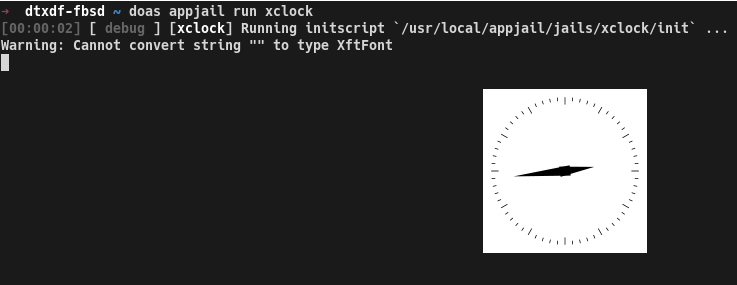

# AppJail

AppJail is an open source framework entirely written in `sh(1)` and C to create isolated, portable and easy to deploy environments using FreeBSD jails that behaves like an application.

## Features

* Easy to use.
* Parallel startup (Jails & NAT).
* UFS and ZFS support.
* RACCT/RCTL support.
* NAT support.
* Port expose - network port forwarding into jail.
* IPv4 and IPv6 support.
* DHCP and SLAAC support.
* Virtual networks - A jail can be on several virtual networks at the same time.
* Bridge support.
* VNET support
* Deploy your applications much easier using Makejail!
* Netgraph support.
* LinuxJails support.
* Supports thin and thick jails.
* TinyJails - Experimental feature to create a very stripped down jail that is very useful to distribute.
* Startup order control - Using priorities and the boot flag makes management much easier.
* Jail dependency support.
* Initscripts - Make your jails interactive!
* Backup your jails using tarballs or raw images (ZFS only) with a single command.
* Modular structure - each command is a unique file that has its own responsability in AppJail. This makes AppJail maintenance much easier.
* Table interface - many commands have a table-like interface, which is very familiar to many sysadmin tools.
* No databases - each configuration is separated in each entity (networks, jails, etc.) which makes maintenance much easier.
* Supervisor - Coming soon ...
* ...

## Installation

```
git clone https://github.com/DtxdF/AppJail.git
cd AppJail
make install
sysrc appjail_enable="YES"
sysrc appjail_natnet_enable="YES"
```

If you want to use a custom configuration file, create one in `/usr/local/etc/appjail/appjail.conf`. See more details in `/usr/local/share/appjail/files/default.conf`.

## Getting started

To create a very basic jail, only two things are needed: obtaining the FreeBSD components (base.txz, lib32.txz, etc.) and creating the jail using those components.

```
appjail fetch
appjail quick myjail start login
```

Using the `appjail fetch` command will download the `MANIFEST` file to check the components. Afterwards, AppJail will download the components. By default, AppJail will only download `base.txz`. AppJail will extract those components into its release directory.

At this point, AppJail can create a jail using the `appjail quick` command. In the above example, `appjail quick` will create a jail called `myjail`. Using the `start` option, AppJail will start the jail after its creation. The `login` option simply logs into the jail after startup.

The `appjail fetch` is not necessary to run again unless you need another release with different components.

More complex examples will be shown later.

## LinuxJails

A linux distro in a jail is very useful for running isolated applications that are not currently in the FreeBSD ports collection.

AppJail will load the following kernel modules before using this option:

* `fdescfs`
* `linprocfs`
* `tmpfs`
* `linsysfs`
* `pty`
* `linux`: `amd64` and `i386` only.
* `linux64`: `amd64` and `aarch64` only.

You probably want to put those modules in your `loader.conf(5)`.

```sh
appjail fetch debootstrap bullseye
appjail quick debian osversion=bullseye type=linux+debootstrap start linuxfs devfs_ruleset=0 template=/tmp/linux.conf login
```

`appjail fetch` will download Debian Bullseye. We need to set the release version with `osversion`, use the `linuxfs` option to mount the filesystems used by the linux distribution, use the ruleset `0` and use a linux-specific template.

The ruleset can be different, you just need to allow `/dev/shm` and `/dev/fd`.

The linux template is as follows:

```
exec.start: "/bin/true"
exec.stop: "/bin/true"
persist
```

**Note**: You need to install `sysutils/debootstrap` before using this method.

## Networking

### Firewall/Packet filter

#### pf

Not all network options use the firewall to operate, but it is worthwhile for a section to do so when an option requiring the firewall is needed.

AppJail uses anchors like other applications that use `pf(4)` as a backend. Just enable `pf(4)` in `rc.conf(5)`, put the anchors in the `pf.conf(5)` file and reload the rules.

```sh
# Enable pf(4):
sysrc pf_enable="YES"
sysrc pflog_enable="YES"
# Put the anchors in pf.conf(5):
cat << "EOF" >> /etc/pf.conf
nat-anchor 'appjail-nat/jail/*'
nat-anchor "appjail-nat/network/*"
rdr-anchor "appjail-rdr/*"
EOF
# Reload the pf(4) rules:
service pf reload
# Or reboot if you don't have pf(4) started:
service pf restart
service pflog restart
```

### Host configuration

Some network options need to forward packets (IPv4) between interfaces, so it is necessary to change some options.

```sh
# sysrc
sysrc gateway_enable="YES"
# sysctl
sysctl net.inet.ip.forwarding=1
```

### Default interfaces

Some network options require `EXT_IF` and `ON_IF` to be set. AppJail uses `EXT_IF` as the external interface that is normally used to obtain its IP address. The firewall uses `ON_IF` to operate on this interface.

AppJail obtains the default interface, when `EXT_IF` is not configured, from IPv4 routes, if it fails, it tries again using IPv6 routes, if it fails, an error is displayed. If it succeeds, the obtained interface is used. If `ON_IF` is not defined, the `EXT_IF` value is used.

Some options may use different interfaces if specified by the user.

**Note**: Is is highly recommended to configure `EXT_IF` and `ON_IF` to improve performance and make your environment much more stable.

### alias

AppJail can use IP aliases in a jail. This type of configuration does not provide isolation, but may be useful for some applications.

```sh
# IPv4
appjail quick myjail alias=jext ip4="192.168.1.120/24" overwrite start resolv_conf
# IPv6
appjail quick myjail alias=jext ip6="2001:db8:0:1::2/64" overwrite start resolv_conf
# Dual
appjail quick myjail alias=em0 ip4="192.168.1.120/24" ip6="2001:db8:0:1::2/64" overwrite start resolv_conf
# Multiple interfaces
appjail quick myjail alias ip4="jext|192.168.1.120/24" ip6="em0|2001:db8:0:1::2/64" overwrite start resolv_conf
```

The extra options that we have not seen and that the above command uses are `overwrite`, to stop and destroy the jail if it exists and `resolv_conf`, to copy the `resolv.conf(5)` file from the host to the jail.

### Virtual network

Virtual networks are a useful feature of AppJail for creating private and isolated networks. A jail can be on multiple virtual networks at the same time. For example, it is possible to have a jail on one network for development and another for production.

I recommend using the private space (RFC 1918) to organize your virtual networks:

* 10.0.0.0/8
* 172.16.0.0/12
* 192.168.0.0/16

To create a virtual network, we can use the `appjail network` command, but we need three things: network address, CIDR and the network name. The following example creates a network called `development` using `10.42.0.0` as the network address, and `24` as the CIDR.

```sh
appjail network add development 10.42.0.0/24
```

AppJail will load the following kernel modules before using this option:

* `if_bridge`
* `bridgestp`
* `if_epair`

You probably want to put those modules in your `loader.conf(5)`.

Now, we can create a jail that is on the `development` network by simply using the `virtualnet` option.

```sh
appjail quick myjail virtualnet="development:myjail" overwrite start
```

`myjail` is the interface name. This interface is created using cloning against `if_epair(4)`, so two pairs will be created for both the host and the jail.

We will create another jail that will be on the same network as `myjail` to show its communication using `ping(8)`.

```sh
appjail quick otherjail virtualnet="development:otherjail" overwrite start
```

To obtain the IP address of each jail we can use `appjail network hosts`.

**myjail**:
```
# appjail network hosts -REj myjail
10.42.0.2       development
```

**otherjail**:
```
# appjail network hosts -REj otherjail
10.42.0.3       development
```

```
# appjail cmd jexec otherjail ping -c4 10.42.0.2
PING 10.42.0.2 (10.42.0.2): 56 data bytes
64 bytes from 10.42.0.2: icmp_seq=0 ttl=64 time=0.175 ms
64 bytes from 10.42.0.2: icmp_seq=1 ttl=64 time=0.164 ms
64 bytes from 10.42.0.2: icmp_seq=2 ttl=64 time=0.165 ms
64 bytes from 10.42.0.2: icmp_seq=3 ttl=64 time=0.163 ms

--- 10.42.0.2 ping statistics ---
4 packets transmitted, 4 packets received, 0.0% packet loss
round-trip min/avg/max/stddev = 0.163/0.167/0.175/0.005 ms
```

### alias & Virtual Network

The main motivation for combining the `alias` and `virtualnet` options is to provide a way for jails that do not use VNET, such as LinuxJails.

To use both options we need to create another loopback interface:

```sh
sysrc cloned_interfaces+="lo1"
sysrc ifconfig_lo1_name="appjail0"
service netif cloneup
```

The name of the interface can be whatever you want, but I recommend keeping it simple.

```sh
appjail quick debian \
    alias="appjail0" \
    virtualnet="development" \
    osversion=bullseye \
    type=linux+debootstrap \
    start \
    linuxfs \
    devfs_ruleset=0 \
    template=/tmp/linux.conf \
    overwrite
```

### ip4_inherit & ip6_inherit

Inheriting the network stack from the host is useful for applications that do not need network isolation in any way. However, this will cause some problems for some applications.

To use this network configuration type, just use `ip4_inherit` or `ip6_inherit` or both.

```sh
appjail quick myjail alias ip4_inherit ip6_inherit resolv_conf overwrite start
```

### ip4_disable & ip6_disable

IPv4 or IPv6 can be disabled in AppJail with the `ip4_disable` or `ip6_disable` options.

```sh
appjail quick myjail alias ip4_disable ip6_disable resolv_conf overwrite start
```

### jng

The `jng` script uses some Netgraph nodes, such as `ng_bridge(4)` and `ng_eiface(4)` to attach an interface. AppJail can use this script to get the advantages of using Netgraph in jails.

AppJail will load the following kernel module before using this option:

* `ng_ether`

You probably want to put that module in your `loader.conf(5)`.

```sh
appjail quick myjail jng="myjail jext" overwrite start
```

`myjail` is the name used for the links and `jext` is the interface that will be attached to the bridge. In the above example, `jng` will create a node called `ng0_myjail` and a bridge called `jextbridge`.

**Note**: You need to install the `jng` script before using this option. Run `install -m 555 /usr/share/examples/jails/jng /usr/local/bin/jng` to install it.

### Bridges

AppJail can create bridges and epairs on demand using this option. This is very useful to provide connection with the outside to some jails when it is really necessary.

This provides isolation that NAT cannot, so combining NAT and this option does not make much sense.

```sh
appjail quick jbridge bridge="jpub iface:jext" start
# custom bridge
appjail quick jbridge bridge="jpub iface:jext bridge:public" start
```

AppJail will create two interfaces called `s[ab]_jpub`. The `sa_jpub` interface is attached to the bridge and the `sb_jpub` is used by the jail.

AppJail does not create bridges and epairs unless they do not exist. It also cannot add an interface as a member of a bridge when it is already added.

By default, a bridge called `SHARED_BRIDGE` (default: `appjail`) is created unless you provide another name as you have seen.

Suppose we are installing packages and we don't want to provide connection to the outside until we really need it. AppJail can detach an interface that is a member of a bridge using `appjail network detach`.

```sh
appjail network detach jpub
```

However, it is necessary to edit the template using `appjail config -ej jbridge` and remove the lines where AppJail attaches the interface to not provide connection to the outside when the jail is restarted.

AppJail does not destroy an interface that is not a member of the specified bridge, so if we stop the jail using `appjail stop` the `s[ab]_jpub` interface is still in the system. To force the destruction of an `if_epair(4)` interface use `appjail network detach -df`.

```sh
appjail network detach -df jpub
```

**Note**: An interface cannot be used on a bridge that is a member of another bridge.

### VNET

You will probably want to use another interface on your system that is not in use. AppJail can take advantage of this and VNET using the `vnet` option.

```sh
appjail quick jvnet vnet=em0 start
```

### DHCP & SLAAC

AppJail can use DHCP or SLAAC to rely on another node in the network. As you can see in the previous sections each option has its own way to rename an interface, but fortunately it is easy to remember.

Before using DHCP, we need to configure a ruleset in our `devfs.rules(5)` to allow `bpf(4)` and other relevant devices.

**/etc/devfs.rules**:
```
[devfsrules_dhcp=10]
add include $devfsrules_jail_vnet
add path 'bpf*' unhide
```

```sh
# VNET + DHCP
 appjail quick jdhcp \
    vnet=em0 \
    dhcp=em0 \
    mount_devfs \
    devfs_ruleset=10 \
    start
# Netgraph + DHCP
appjail quick jdhcp \
    jng="jdhcp em0" \
    dhcp=ng0_jdhcp \
    mount_devfs \
    devfs_ruleset=10 \
    start \
    overwrite
# Netgraph + Bridge + DHCP
appjail quick jdhcp \
    jng="jdhcp em0" \
    bridge="iface:jext jdhcp" \
    dhcp=ng0_jdhcp \
    dhcp=sb_jdhcp \
    mount_devfs \
    devfs_ruleset=10 \
    start \
    overwrite
```

IPv6 has grown rapidly in some countries and one way to configure an interface that wants to use this new version of IP is to rely on SLAAC. You can use AppJail to create a jail that use SLAAC in the same way as DHCP.

```sh
# VNET + SLAAC
appjail quick jslaac \
    vnet="em0" \
    slaac="em0" \
    start \
    overwrite
# VNET + SLAAC + Bridge + DHCP
appjail quick jds \
    vnet="em0" \
    slaac="em0" \
    bridge="iface:jext jds" \
    dhcp="sb_jds" \
    mount_devfs \
    devfs_ruleset=10 \
    start
```

**Note**: Remember that any interface you use with VNET disappears, so you will probably want to stop the jail using that interface if you want to use it on another.

I recommend reading `Pragmatic IPv6 (part 1)` and `Pragmatic IPv6 (part 2)` by `Hiroki Sato`.

### multi-(virtual)net & bridges

A jail can be in several virtual networks at the same time. This can be very useful to organize the jails in a logic that suits your environment.

For example, we can create three jails: jdb, a database server, jweb, a web server and jdev, a jail to develop our application that uses the services provided by other jails.

We will create three networks: `web` for web servers (e.g.: nginx, apache, php-fpm, APIs, etc.), `db` for databases (e.g.: mongodb, mariadb, mysql, redis, etc.) and `development`, jails that we will use only for development. Our jail for development must be in the networks where the other jails are.

Virtual networks cannot provide connections to the outside, so we cannot install any packages or upgrade them. We cant use NAT, which will be shown later, or bridges, which is the case in the current section.

```sh
#
# Networks
#

# db
appjail network add db 10.42.0.0/24
# web
appjail network add web 10.0.0.0/24
# development
appjail network add development 192.168.0.0/10

#
# Jails
#

# jdb
appjail quick jdb virtualnet="db:jdb" bridge="jdb iface:jext" start
# jweb
appjail quick jweb virtualnet="web:jweb" bridge="jweb iface:jext" start
# jdev
appjail quick jdev virtualnet="db:jd1" virtualnet="development:jd2" virtualnet="web:jd3" bridge="jdev iface:jext" start
```

Now, we can configure the interfaces that are attached to the shared bridge (see `Bridges`) to provide connections to the outside. The above example does not use DHCP or SLAAC, but you can use it (see `DHCP & SLAAC`).

After configuring the network parameters for our interfaces inside the jail, we can install software, configure them and when we are done, we probably don't want to get connection to the outside for the `jdb` and `jweb` jails.

```sh
appjail network detach jdb
appjail network detach jweb
```

Remember to edit the respective templates so that the above changes persist, as described in `Bridges`.

### multi-bridges

Virtual networks are useful, but another useful feature of AppJail is bridges, as described in previous sections.

This is useful when you want to have better control of the address pool using a DHCP server such as `dns/dnsmasq` or for some more specific application.

```sh
# jpub
appjail quick jpub \
    bridge="jpb1 iface:jext bridge:public" \
    bridge="jpb2 bridge:private" \
    mount_devfs \
    devfs_ruleset=10 \
    dhcp="sb_jpb1" \
    dhcp="sb_jpb2" \
    overwrite
# jpriv
appjail quick jpriv \
    bridge="jpv bridge:private" \
    mount_devfs \
    devfs_ruleset=10 \
    dhcp="sb_jpv" \
    overwrite 
```

`jpub` is on both `private` and `public` bridges, so it can connect to the outside and can communicate with other jails on the `private` bridge. `jpriv` cannot make connections to the outside, so we need a private DHCP server.

```sh
ifconfig private inet 129.0.0.1/24
dnsmasq --interface=private --dhcp-range=129.0.0.2,129.0.0.150,12h -d
```

Jails are started and should have their IP addresses.

```
# appjail start jpub
...
# appjail cmd jexec jpub ifconfig sb_jpb1 inet
sb_jpb1: flags=8863<UP,BROADCAST,RUNNING,SIMPLEX,MULTICAST> metric 0 mtu 1500
        options=8<VLAN_MTU>
        inet 192.168.1.104 netmask 0xffffff00 broadcast 192.168.1.255
# appjail cmd jexec jpub ifconfig sb_jpb2 inet
sb_jpb2: flags=8863<UP,BROADCAST,RUNNING,SIMPLEX,MULTICAST> metric 0 mtu 1500
        options=8<VLAN_MTU>
        inet 129.0.0.58 netmask 0xffffff00 broadcast 129.0.0.255 
# appjail start jpriv
...
# appjail cmd jexec jpriv ifconfig sb_jpv inet
sb_jpv: flags=8863<UP,BROADCAST,RUNNING,SIMPLEX,MULTICAST> metric 0 mtu 1500
        options=8<VLAN_MTU>
        inet 129.0.0.88 netmask 0xffffff00 broadcast 129.0.0.255
```

### NAT

Thanks to virtual networks, AppJail can use NAT in two ways: manually, using `appjail nat` or automatically using `appjail quick`.

You must read `Firewall/Packet filter` and `Host configuration` before using this option.

```sh
appjail quick jnat virtualnet="development:jnat default" nat start
# explicitly
appjail quick jnat virtualnet="development:jnat default" nat="network:development" overwrite start
```

The `nat` option requires the `network` parameter to be defined, but as you can see in the example above, the virtual network `development` is the default network, which implies that the gateway is used as the default router, also, as `appjail quick` knows, it uses that network implicitly in some options like `nat` and `expose`.

You can apply NAT on multiple networks. This is useful only if you plan to use the source address for different purposes.

```
# appjail quick jnat virtualnet="development:jn1 default" virtualnet="web:jn2" nat nat="network:web" start overwrite
...
# appjail network hosts -REj jnat
192.128.0.2     development
10.0.0.2        web
# appjail cmd jexec jnat ping -c4 -S 192.128.0.2 8.8.8.8
PING 8.8.8.8 (8.8.8.8) from 192.128.0.2: 56 data bytes
64 bytes from 8.8.8.8: icmp_seq=0 ttl=114 time=45.209 ms
64 bytes from 8.8.8.8: icmp_seq=1 ttl=114 time=44.204 ms
64 bytes from 8.8.8.8: icmp_seq=2 ttl=114 time=44.436 ms
64 bytes from 8.8.8.8: icmp_seq=3 ttl=114 time=44.864 ms

--- 8.8.8.8 ping statistics ---
4 packets transmitted, 4 packets received, 0.0% packet loss
round-trip min/avg/max/stddev = 44.204/44.678/45.209/0.387 ms
# appjail cmd jexec jnat ping -c4 -S 10.0.0.2 8.8.8.8
PING 8.8.8.8 (8.8.8.8) from 10.0.0.2: 56 data bytes
64 bytes from 8.8.8.8: icmp_seq=0 ttl=114 time=44.984 ms
64 bytes from 8.8.8.8: icmp_seq=1 ttl=114 time=45.167 ms
64 bytes from 8.8.8.8: icmp_seq=2 ttl=114 time=44.426 ms
64 bytes from 8.8.8.8: icmp_seq=3 ttl=114 time=44.581 ms

--- 8.8.8.8 ping statistics ---
4 packets transmitted, 4 packets received, 0.0% packet loss
round-trip min/avg/max/stddev = 44.426/44.789/45.167/0.298 ms
```

To create NAT rules manually for an existing jail, we can use `appjail nat`.

```sh
appjail quick jnat virtualnet="development:jn1 default" overwrite
appjail nat add jail -n development jnat
appjail config -Ia 'exec.prestart="appjail nat on jail ${name}"' -j jnat
appjail config -Ia 'exec.poststop="appjail nat off jail ${name}"' -j jnat
appjail start jnat
```

AppJail can apply NAT to an entire network space instead of a single jail. To do this, we need to use `appjail nat network` in the same way AppJail does for jails manually.

```
# appjail nat add network db
# appjail nat on network db
# appjail nat boot on network db
# service appjail-natnet status
NAT Information:

BOOT  NAME  RULE
1     db    nat on "jext" from 10.42.0.0/24 to any -> ("jext:0")

Status:

nat on jext inet from 10.42.0.0/24 to any -> (jext:0) round-robin
```

The `appjail nat boot on network` command sets the boot flag to apply NAT rules when starting FreeBSD using the `appjail-natnet` service.

When applying NAT rules for networks, it can be useful to apply NONAT for a single jail to avoid masking its IP address. AppJail can do this in the same way as NAT rules.

```sh
# Using appjail quick:
appjail quick jnonat virtualnet="db:jnonat default" nonat overwrite start
# Manually:
appjail quick jnonat virtualnet="db:jnonat default" overwrite
appjail nat add jail -n db -N jnonat
appjail config -Ia 'exec.prestart="appjail nat on jail ${name}"' -j jnonat
appjail config -Ia 'exec.poststop="appjail nat off jail ${name}"' -j jnonat
appjail start jnonat
```

**Note**: Since IP forwarding is enabled, jails that are on different networks do not get isolation. This is not a problem when isolation is not necessary in such a way, you can use the firewall to block some packets, but you can also use virtual networks with IP forwarding enabled simply to get better organization. Consider using `Bridges` when possible.

### Port forwarding

A jail can act as a service that our clients can take advantage of, but if we use NAT instead of bridging, we need to forward a host port to a jail port. Fortunately, AppJail can do that in a very easy way.

You must read `Firewall/Packet filter` and `Host configuration` before using this option.

For example, NGINX can be used in a jail to provide a web server to our customers:

```sh
# Using appjail quick:
appjail quick nginx virtualnet="web:nginx default" nat expose=80 start
# Manually:
appjail quick nginx virtualnet="web:nginx default" nat overwrite
appjail expose set -k web -p 80 nginx
appjail config -Ia 'exec.prestart="appjail expose on ${name}"' -j nginx
appjail config -Ia 'exec.poststop="appjail expose off ${name}"' -j nginx
appjail start nginx
# www/nginx:
appjail pkg jail nginx install -y nginx
appjail sysrc jail nginx nginx_enable="YES"
appjail service jail nginx nginx start
```

Since we are the host we can make an HTTP request using the jail's IPv4 address (assuming it is `10.0.0.2`).

```
# fetch -qo - http://10.0.0.2
<!DOCTYPE html>
<html>
<head>
<title>Welcome to nginx!</title>
...
```

Another host on the host network can use the host's IPv4 address (assuming it is `192.168.1.105`) to make an HTTP request as in the example above.

```
# fetch -qo - http://192.168.1.105
<!DOCTYPE html>
<html>
<head>
<title>Welcome to nginx!</title>
...
```

## ZFS

AppJails supports ZFS to take advantage of its benefits, such as snapshotting, cloning, fast backups, quotas, and so on. To enable ZFS in AppJail, simply change `ENABLE_ZFS` to `1`.

Do not mix UFS and ZFS installations, change `PREFIX` and other ZFS related options and migrate the jails by importing and exporting them.

There are other ZFS related options that you can configure for your environment. `ZPOOL` (default: `zroot`), the pool name. `ZROOTFS` (default: `appjail`) will be concatenated with `ZPOOL` to be used as a prefix for datasets. `ZOPTS` (default: `-o compress=lz4`), options for `zfs-create(8)`.

## Resource limits (RACCT/RCTL)

AppJail can limit jail resources using `rctl(4)`. To use it, you need to enable it in `loader.conf(5)` and reboot your system.

```
kern.racct.enable=1
```

Like many AppJail commands, limits can be set using `appjail quick` or its own command to apply `rctl(4)` rules to an existing jail.

```sh
# Using appjail quick:
appjail quick nginx \
    virtualnet="web:nginx default" \
    nat \
    expose=80 \
    limits="vmemoryuse:deny=512m" \
    limits="vmemoryuse:log=450m" \
    limits="maxproc:log=30" \
    start \
    overwrite

# Manually:
appjail quick nginx virtualnet="web:nginx default" nat expose=80 overwrite
appjail limits set nginx vmemoryuse:deny=512m
appjail limits set nginx vmemoryuse:log=450m
appjail limits set nginx maxproc:log=30
appjail config -Ia 'exec.created="appjail limits on ${name}"' -j nginx
appjail config -Ia 'exec.poststop="appjail limits off ${name}"' -j nginx
appjail start nginx
```

To display the current rules of a jail, run `appjail limits list`.

```
# appjail limits list nginx
NRO  ENABLED  NAME  RULE                  LOADED
0    1        -     vmemoryuse:deny=512m  jail:nginx:vmemoryuse:deny=512M
1    1        -     vmemoryuse:log=450m   jail:nginx:vmemoryuse:log=450M
2    1        -     maxproc:log=30        jail:nginx:maxproc:log=30
```

In addition, we can use AppJail to display resource usage in a table-like interface.

```
# appjail limits stats myjail
MAXPROC  CPUTIME  PCPU  VMEMORYUSE  READIOPS  WRITEIOPS
7        13       0     99M         0         0
```

AppJail only shows a few keywords, but `rctl(4)` has many:

```
# appjail limits stats myjail openfiles cputime datasize stacksize
OPENFILES  CPUTIME  DATASIZE  STACKSIZE
1576       13       1008K     0
```

## CPU Sets

You can assign some specific CPUs to a jail for more resource constraint using the `cpuset` option in `appjail quick`:

```sh
appjail quick jtest cpuset="2-4,5,7" start
```

## Templates

AppJail cannot parse a `jail.conf(5)` file, but it can parse its own format: templates.

The main motivation for using templates is to easily parse a file for scripts and for humans. See the following example:

```
# appjail config -Agj nginx
exec.start: "/bin/sh /etc/rc"
exec.stop: "/bin/sh /etc/rc.shutdown jail"
mount.devfs:
vnet:
vnet.interface+: "eb_nginx"
exec.prestart+: "appjail network plug -e \"nginx\" -n \"web\""
exec.poststart+: "appjail network assign -d -e \"nginx\" -j \"${name}\" -n \"web\""
exec.poststop+: "appjail network unplug \"web\" \"nginx\""
exec.prestart+: "appjail nat on jail \"${name}\""
exec.poststop+: "appjail nat off jail \"${name}\""
exec.prestart+: "appjail expose on \"${name}\""
exec.poststop+: "appjail expose off \"${name}\""
exec.created+: "appjail limits on ${name}"
exec.poststop+: "appjail limits off ${name}"
```

The syntax is based on `jail.conf(5)`, but has some differences:

* Semicolon (`;`) separator is not used. AppJail parses the file line by line.
* `:` instead of `=`.
* `+:` instead of `+=`.
* Lists does not exist, but the AppJail tokenizer can achieve the same effect using rows and columns:
  - Rows are parameters that are repeated in the template. They are usually separated using `+:` when there is more than one, but it is optional, although it is very important to put the correct operator because AppJail translates the template to a `jail.conf(5)` file. A particular row can be accessed using an index from `0`.
  - Columns are the value of a row. They are separated using spaces, but the column in quotes can be used to use spaces in the column. The `\` character must be used to escape `"`. A particular column can be accessed using an index from `0`. `0` is for accessing the entire value of a row and a number greater than `0` is for accessing the particular column.

AppJail tries to not to lose functionality by using this format. You can use variables, for example.

Although you can use any parameter you want in a template, `appjail start` intercepts some parameters:

* `exec.consolelog`: If not set, AppJail sets it in a console log type. See `Logs`.
* `mount.fstab`: If not set, AppJail uses the compiled fields of the `appjail fstab` command. See `Mounting file systems`.
* `host.hostname`: If not set, AppJail concatenates the jail name and `HOST_DOMAIN` (default: `.appjail`).
* `depend`: If set, AppJail will recursively start these jails. See `Dependent jails`.

At the moment, AppJail only checks the template syntax and parameters, but does not check if the parameters exist in `jail(8)`. See `TODO`.

As mentioned above, you can use rows and columns instead of lists. To illustrate this, the following is useful:

**example.conf**:
```
exec.start: "/bin/sh /etc/rc"
exec.stop: "/bin/sh /etc/rc.shutdown jail"
mount.devfs
interface: jext
ip4.addr: 192.168.1.123/24 192.168.1.128/24
ip4.addr+: 10.42.0.4/10
```

The template has it all for learning about templates. For example, `exec.start` has spaces. `mount.devfs` has no value. `ip4.addr` has two rows. The first row of `ip4.addr` has two columns and the second row has one.

We can get the value of `exec.start`.

```
# appjail config -gt example.conf -a exec.start
exec.start: "/bin/sh /etc/rc"
```

The values are not escaped, since we are getting the whole value, not a column. To get the value of column `1` we can use:

```
# appjail config -gt example.conf -a exec.start -C 1
exec.start: /bin/sh /etc/rc
```

To get only the value of column `1` but not its parameter name:

```
# appjail config -gt example.conf -a exec.start -C 1 -n
/bin/sh /etc/rc
```

Another useful example is `ip4.addr`. To edit the whole value of row `1`:

```
# appjail config -st example.conf -a ip4.addr=10.42.0.3/10 -R 1
# appjail config -gt example.conf -a ip4.addr -R 1
ip4.addr+: 10.42.0.3/10
```

However, if we want to edit row `0` with some columns, we probably do not want to edit the whole value. To edit only column `2`.

```
# appjail config -st example.conf -a ip4.addr=192.168.1.176/24 -C 2
# appjail config -gt example.conf -a ip4.addr
ip4.addr: 192.168.1.123/24 192.168.1.176/24
```

Templates have another useful feature: `required parameters`.

Instead of using static parameters with values that may not be portable across multiples environments, we can use `required parameters` to force the user to edit some parameters. If the user does not edit those parameters, the jail won't start.

`required parameters` are parameters starting with an asterisk (`*`). The value is optional, but if set, `appjail start` uses it to display a custom message.

```
exec.start: "/bin/sh /etc/rc"
exec.stop: "/bin/sh /etc/rc.shutdown jail"
mount.devfs
vnet
*vnet.interface: VNET requires an interface.
```

We can open an editor using `appjail config -e` or use `appjail config -sr` to convert a parameter into a required one.

As mentioned, if we do not edit the template before starting the jail, `appjail start` will complain:

```
# appjail quick vjail start template=/tmp/vnet.conf
...
[00:00:15] [ warn  ] [vjail] There are required parameters that must be set before starting the jail:
[00:00:15] [ warn  ] [vjail]     - vnet.interface: VNET requires an interface.
[00:00:15] [ warn  ] [vjail] You can use `appjail config` to set the required parameters
```

We can use `appjail config` to solve this problem. We can use `appjail config -e` to open the editor specified by the `EDITOR` environment variable or use `appjail config -s` as if we were configuring any other parameter.

```sh
# Using ${EDITOR}.
appjail config -ej vjail
# Using command-line interface.
appjail config -sj vjail -a 'vnet.interface=jext'
```

To see the change we can use `appjail config -g`.

```
# appjail config -gj vjail -a 'vnet.interface'
vnet.interface: jext
```

If you want to list the `required parameters`:

```
# appjail config -kt alias.conf
*interface: Interface name.
*ip4.addr: IPv4 address to use.
```

**alias.conf**:
```
exec.start: "/bin/sh /etc/rc"
exec.stop: "/bin/sh /etc/rc.shutdown jail"
mount.devfs
*interface: Interface name.
*ip4.addr: IPv4 address to use.
```

`appjail config` has many parameters to list here, but I think the above examples show the basics.

## Initscripts

Initscripts are another useful feature of AppJail that are the core of Makejail. An initscript is simply a `sh(1)` script that AppJail loads to run a `stage`. A `stage` is a function within the initscript that is executed by an AppJail command as follows:

* `create`: `appjail start` will run this `stage` before the jail starts.
* `start`: `appjail start` will run this `stage` after the jail starts.
* `stop`: `appjail stop` will run this `stage` after the jail is stopped.
* `cmd`: `appjail run` will run this `stage` only when the jail is running.

Each `stage` has `pre-` and `post-` functions. `pre-` is executed before `stage` is executed and if it fails, `stage` will not be executed. `post-` will be executed after `pre-` and `stage` even if they fail. `pre-` and `stage` affect the exit status, but `post-` does not. `stage` and functions in a initscript are all optional, AppJail will execute them if they exist.

The following example contains all stages and functions:

```sh
_parse_args()
{
	local arg
	for arg in "$@"; do
		printf "<%s> " "${arg}"
	done
	echo
}

precreate()
{
	echo -n "precreate args: "
	_parse_args "$@"
}

create()
{
	echo -n "create args: "
	_parse_args "$@"
}

postcreate()
{
	echo -n "postcreate args: "
	_parse_args "$@"
}

prestart()
{
	echo -n "prestart args: "
	_parse_args "$@"
}

start()
{
	echo -n "start args: "
	_parse_args "$@"
}

poststart()
{
	echo -n "poststart args: "
	_parse_args "$@"
}

precmd()
{
	echo -n "precmd args: "
	_parse_args "$@"
}

cmd()
{
	echo -n "cmd args: "
	_parse_args "$@"
}

postcmd()
{
	echo -n "postcmd args: "
	_parse_args "$@"
}

prestop()
{
	echo -n "prestop args: "
	_parse_args "$@"
}

stop()
{
	echo -n "stop args: "
	_parse_args "$@"
}

poststop()
{
	echo -n "poststop args: "
	_parse_args "$@"
}
```

We use the `initscript` option in `appjail quick` to use this initscript in our new jail.

```sh
chmod +x /tmp/initscript
appjail quick myjail overwrite initscript=/tmp/initscript
```

The jail will not start because we are not using the `start` option, this is because we will start the jail manually to pass arguments for `create` and for `start` stages.

```
# appjail start -c 'parameter1=I am the create parameter #1' -c 'parameter2=I am the create parameter #2' -s 'parameter1=I am the start parameter #1' -s 'parameter2=I am the start parameter #2' myjail
...
[00:00:17] [ debug ] [myjail] Running initscript `/usr/local/appjail/jails/myjail/init` ...
[00:00:17] [ debug ] [myjail] Running precreate() ...
precreate args: <--parameter1> <I am the create parameter #1> <--parameter2> <I am the create parameter #2>
[00:00:17] [ debug ] [myjail] precreate() exits with status code 0
create args: <--parameter1> <I am the create parameter #1> <--parameter2> <I am the create parameter #2>
[00:00:17] [ debug ] [myjail] create() exits with status code 0
postcreate args: <--parameter1> <I am the create parameter #1> <--parameter2> <I am the create parameter #2>
[00:00:17] [ debug ] [myjail] postcreate() exits with status code 0
[00:00:17] [ debug ] [myjail] `/usr/local/appjail/jails/myjail/init` exits with status code 0
[00:00:17] [ debug ] [myjail] Creating...
[00:00:19] [ info  ] [myjail] myjail: created
[00:00:20] [ debug ] [myjail] Running initscript `/usr/local/appjail/jails/myjail/init` ...
[00:00:20] [ debug ] [myjail] Running prestart() ...
prestart args: <--parameter1> <I am the start parameter #1> <--parameter2> <I am the start parameter #2>
[00:00:20] [ debug ] [myjail] prestart() exits with status code 0
start args: <--parameter1> <I am the start parameter #1> <--parameter2> <I am the start parameter #2>
[00:00:20] [ debug ] [myjail] start() exits with status code 0
poststart args: <--parameter1> <I am the start parameter #1> <--parameter2> <I am the start parameter #2>
[00:00:20] [ debug ] [myjail] poststart() exits with status code 0
[00:00:20] [ debug ] [myjail] `/usr/local/appjail/jails/myjail/init` exits with status code 0
```

As you can see, the `pre-` and `post-` functions receive the same parameters as their `stage`.

`appjail run` will run `cmd` whenever we want and only if the jail is running.

```
# appjail run -p 'msg=Hello, world!' myjail
[00:00:01] [ debug ] [myjail] Running initscript `/usr/local/appjail/jails/myjail/init` ...
[00:00:01] [ debug ] [myjail] Running precmd() ...
precmd args: <--msg> <Hello, world!>
[00:00:01] [ debug ] [myjail] precmd() exits with status code 0
cmd args: <--msg> <Hello, world!>
[00:00:01] [ debug ] [myjail] cmd() exits with status code 0
postcmd args: <--msg> <Hello, world!>
[00:00:01] [ debug ] [myjail] postcmd() exits with status code 0
[00:00:01] [ debug ] [myjail] `/usr/local/appjail/jails/myjail/init` exits with status code 0
```

Finally, we can pass arguments to `stop`:

```
# appjail stop -p 'msg=Bye ...' myjail
[00:00:02] [ debug ] [myjail] Running initscript `/usr/local/appjail/jails/myjail/init` ...
[00:00:02] [ debug ] [myjail] Running prestop() ...
prestop args: <--msg> <Bye ...>
[00:00:02] [ debug ] [myjail] prestop() exits with status code 0
stop args: <--msg> <Bye ...>
[00:00:02] [ debug ] [myjail] stop() exits with status code 0
poststop args: <--msg> <Bye ...>
[00:00:02] [ debug ] [myjail] poststop() exits with status code 0
[00:00:02] [ debug ] [myjail] `/usr/local/appjail/jails/myjail/init` exits with status code 0
...
```

`appjail enable` is a command to enable arguments that need to be passed when the user does not provide them. This is necessary for commands such as `appjail startup` or `appjail restart` because these commands does not accept arguments for stages.

```sh
appjail enable myjail start -c 'create_msg=Hi everyone!' -s 'start_msg=Welcome.'
appjail enable myjail stop -p 'stop_msg=Bye.'
```

If we start or stop the jail without passing arguments, `appjail start` or `appjail stop` will use the arguments of the `appjail enable` command.

```
# appjail start myjail
...
[00:00:18] [ debug ] [myjail] Running initscript `/usr/local/appjail/jails/myjail/init` ...
[00:00:18] [ debug ] [myjail] Running precreate() ...
precreate args: <--create_msg> <Hi everyone!>
[00:00:18] [ debug ] [myjail] precreate() exits with status code 0
create args: <--create_msg> <Hi everyone!>
[00:00:18] [ debug ] [myjail] create() exits with status code 0
postcreate args: <--create_msg> <Hi everyone!>
[00:00:18] [ debug ] [myjail] postcreate() exits with status code 0
[00:00:18] [ debug ] [myjail] `/usr/local/appjail/jails/myjail/init` exits with status code 0
[00:00:18] [ debug ] [myjail] Creating...
[00:00:18] [ info  ] [myjail] myjail: created
[00:00:19] [ debug ] [myjail] Running initscript `/usr/local/appjail/jails/myjail/init` ...
[00:00:19] [ debug ] [myjail] Running prestart() ...
prestart args: <--start_msg> <Welcome.>
[00:00:19] [ debug ] [myjail] prestart() exits with status code 0
start args: <--start_msg> <Welcome.>
[00:00:19] [ debug ] [myjail] start() exits with status code 0
poststart args: <--start_msg> <Welcome.>
[00:00:19] [ debug ] [myjail] poststart() exits with status code 0
[00:00:19] [ debug ] [myjail] `/usr/local/appjail/jails/myjail/init` exits with status code 0
```

Initscripts are executed in the host, not in the jail. This decision is to run tasks in the host and tasks in the jail. To execute commands in a jail we use `jexec(8)`, but if we use fixed strings carelessly we may have some problems.

One problem we can see is that we rename a jail. The problem is that a command such as `jexec(8)` that uses the name of the jail to execute commands on it, will not execute correctly because the jail does not exist. Worse, there is a possibility that commands will be executed on a jail with totally different name than the one we intended.

AppJail solves this problem by keeping things simple: using the following environment variables:

* `APPJAIL_CONFIG`: AppJail configuration file.
* `APPJAIL_JAILDIR`: Jail directory (`{APPJAIL_ROOTDIR}/jail`)
* `APPJAIL_JAILNAME`: Jail name.
* `APPJAIL_ROOTDIR`: Root directory of the jail (`{JAILDIR}/{jail_name}`).
* `APPJAIL_SCRIPT`: AppJail script.
* `APPJAIL_PWD`: Since Makejail changes the current directory, `PWD` does not reflect the user's current directory. This environment variable allows a buildscript to know the user's current directory. Only available in the `build` stage of Makejail.

With the above information we can make an initscript to display `Hello, world!`:

```sh
cmd()
{
	jexec -l "${APPJAIL_JAILNAME}" sh -c 'echo "Hello, world!"'
}
```

```
# appjail quick myjail initscript=/tmp/initscript start overwrite
# appjail run myjail
[00:00:06] [ debug ] [myjail] Running initscript `/usr/local/appjail/jails/myjail/init` ...
Hello, world!
[00:00:06] [ debug ] [myjail] cmd() exits with status code 0
[00:00:07] [ debug ] [myjail] `/usr/local/appjail/jails/myjail/init` exits with status code 0
```

Initscripts are a bit complex and there are some ways to create them much easier (See `Makejail`).

## Dependent jails

AppJail can start jails before the jail we are specifying. It works in the same way as dependencies. For example, if we have the NGINX, MariaDB and PHP-FPM jails, we want to start MariaDB, PHP-FPM and NGINX in this order. The idea is to run `appjail start nginx` and AppJail will recursively start the `nginx` jail dependencies first.

We just have to put the `depend` parameter in the template and `appjail start` will do the job of starting dependencies.

```sh
appjail config -sj nginx -a 'depend=php-fpm'
appjail config -sj php-fpm -a 'depend=mariadb'
``` 

The `appjail stop` command will not stop the dependencies because the clients may be using the services offered by those jails. But, AppJail has a command to recursively stop the jail and its dependencies called `appjail rstop`.

`appjail rstop` sorts the jails in the same way as `appjail start` does but in reverse order.

```sh
appjail rstop nginx
```

NGINX, PHP-FPM and MariaDB jails will be stopped in this order.

## Priorities & boot flag

AppJail can start jails at system startup using the `appjail` rc script which is just a wrapper for `appjail startup`. But this command only starts jails that have the `boot flag` set to `on` and the order can be specified using priorities.

Since these features are very useful when used in conjunction with `Dependent jails` we will use the jail used in the previous section.

```sh
appjail jail boot on nginx
```

We can use `appjail jail list` to se if the `boot flag` is enabled for this jail.

```
# appjail jail list -j nginx boot name
BOOT  NAME
1     nginx
```

`appjail quick` can create a jail with the `boot flag`.

```sh
appjail quick myjail boot overwrite
```

Jails have the same priority at the time of their creation (unless you use the `priority` option in `appjail quick`), so `appjail startup` will start the jails in the order they appear. If we want to start a jail before the others we have to change the priority using `appjail jail priority`.

```sh
appjail jail priority -p 10 myjail
```

The `nginx` jail will be started first because `0` is high priority.

Let's see the current priorities of our jails:

```
# appjail jail list boot priority name
BOOT  PRIORITY  NAME
0     0         mariadb
1     10        myjail
1     0         nginx
0     0         php-fpm
0     0         vjail
```

`appjail startup` will stop the previous jails in reverse order.

**Notes**:

1. By default, when a jail is created using `appjail quick` the boot flag is enabled by that jail. See the configuration file for more details.
2. If `USE_PARALLEL` is enabled (default), AppJail starts the jails in parallel with the same priority in that order.

## Logs

AppJail has its own way of saving logs. Fortunately, it is not difficult to learn.

AppJail uses four things: `type`, `entity`, `subtype` and `log`.

* `type`: refers to a group of entities with the same meaning in a context.
* `entity`: refers to an individual thin in a group.
* `subtype`: refers to a group of logs with the same mearing in a context.
* `log`: name of the log.

**types**:

* `commands`: Logs created by commands.
* `jails`: Logs created by jails.
* `nat`: Logs created by the `appjail nat` command or something similar.

**entity**

The entities can be a network, a jail or something similar. They are dynamic.

**subtype**:

* `jails/{ENTITY}/console`: A file to direct command output (stdout and stderr) to.
* `{jails|nat}/{ENTITY}/{startup-start|startup-stop}`: Logs created by the `appjail startup` command.
* `commands/{ENTITY}/output`: When `ENABLE_LOGGING_OUTPUT` is set to 1, AppJail will log all output of a command.

**log**:

The name of the logs can be changed as desired. See the configuration file for details.

Logs can be listed simply using `appjail logs` with no arguments or executing `appjail logs list`.

```
# appjail logs
TYPE   ENTITY     SUBTYPE        LOG
jails  debian     console        2023-02-03.log
jails  debian     console        2023-02-04.log
jails  debian     startup-start  2023-02-03.log
jails  debian     startup-start  2023-02-04.log
jails  debian     startup-stop   2023-02-03.log
jails  debian     startup-stop   2023-02-04.log
jails  jalias     console        2023-02-03.log
jails  jalias     console        2023-02-04.log
jails  jalias     startup-start  2023-02-03.log
jails  jalias     startup-start  2023-02-04.log
jails  jalias     startup-stop   2023-02-03.log
jails  jalias     startup-stop   2023-02-04.log
jails  jalias46   console        2023-02-03.log
jails  jalias46   console        2023-02-04.log
jails  jalias46   startup-start  2023-02-03.log
jails  jalias46   startup-start  2023-02-04.log
jails  jalias46   startup-stop   2023-02-03.log
jails  jalias46   startup-stop   2023-02-04.log
jails  jalias6    console        2023-02-03.log
jails  jalias6    console        2023-02-04.log
jails  jalias6    startup-start  2023-02-03.log
jails  jalias6    startup-start  2023-02-04.log
jails  jalias6    startup-stop   2023-02-03.log
jails  jalias6    startup-stop   2023-02-04.log
jails  jbridge    console        2023-02-03.log
jails  jbridge    console        2023-02-04.log
jails  jbridge    startup-start  2023-02-04.log
jails  jbridge    startup-stop   2023-02-04.log
jails  jdb        console        2023-02-03.log
jails  jdb        console        2023-02-04.log
jails  jdb        startup-start  2023-02-04.log
jails  jdb        startup-stop   2023-02-03.log
jails  jdb        startup-stop   2023-02-04.log
jails  jdev       console        2023-02-03.log
jails  jdev       console        2023-02-04.log
jails  jdev       startup-start  2023-02-04.log
jails  jdev       startup-stop   2023-02-04.log
jails  jdhcp      console        2023-02-03.log
jails  jdhcp      startup-start  2023-02-04.log
jails  jdhcp      startup-stop   2023-02-03.log
jails  jdisable   console        2023-02-03.log
jails  jdisable   console        2023-02-04.log
jails  jdisable   startup-start  2023-02-04.log
jails  jdisable   startup-stop   2023-02-03.log
jails  jdisable   startup-stop   2023-02-04.log
jails  jds        console        2023-02-03.log
jails  jds        startup-start  2023-02-04.log
jails  jinherit   console        2023-02-03.log
jails  jinherit   console        2023-02-04.log
jails  jinherit   startup-start  2023-02-04.log
jails  jinherit   startup-stop   2023-02-03.log
jails  jinherit   startup-stop   2023-02-04.log
jails  jmultinet  console        2023-02-03.log
jails  jmultinet  startup-stop   2023-02-03.log
jails  jnat       console        2023-02-04.log
jails  jnat       startup-start  2023-02-04.log
jails  jnat       startup-stop   2023-02-04.log
jails  jng        console        2023-02-03.log
jails  jng        startup-start  2023-02-04.log
jails  jnonat     console        2023-02-04.log
jails  jpriv      console        2023-02-04.log
jails  jpub       console        2023-02-04.log
jails  jslaac     console        2023-02-03.log
jails  jslaac     console        2023-02-04.log
jails  jslaac     startup-start  2023-02-04.log
jails  jslaac     startup-stop   2023-02-04.log
jails  jtest      console        2023-02-03.log
jails  jtest      console        2023-02-04.log
jails  jtest      startup-start  2023-02-03.log
jails  jtest      startup-stop   2023-02-03.log
jails  jvirtnet   console        2023-02-03.log
jails  jvnet      console        2023-02-03.log
jails  jvnet      startup-start  2023-02-04.log
jails  jweb       console        2023-02-03.log
jails  jweb       console        2023-02-04.log
jails  jweb       startup-start  2023-02-04.log
jails  jweb       startup-stop   2023-02-03.log
jails  jweb       startup-stop   2023-02-04.log
jails  myjail     console        2023-02-03.log
jails  myjail     console        2023-02-04.log
jails  myjail     startup-start  2023-02-03.log
jails  myjail     startup-start  2023-02-04.log
jails  myjail     startup-stop   2023-02-03.log
jails  myjail     startup-stop   2023-02-04.log
jails  nginx      console        2023-02-04.log
jails  otherjail  console        2023-02-03.log
jails  otherjail  console        2023-02-04.log
jails  otherjail  startup-start  2023-02-03.log
jails  otherjail  startup-start  2023-02-04.log
jails  otherjail  startup-stop   2023-02-03.log
jails  otherjail  startup-stop   2023-02-04.log
jails  php        console        2023-02-04.log
jails  php        console        2023-02-04.log
jails  php        startup-start  2023-02-04.log
jails  php        startup-stop   2023-02-04.log
nat    db         startup-start  2023-02-03.log
nat    db         startup-stop   2023-02-03.log
nat    web        startup-start  2023-02-03.log
nat    web        startup-stop   2023-02-03.log
```

`appjail logs read` uses the `PAGER` environment variable to display the log to read. Set `-R` to display ANSI colors correctly.

```
# env PAGER="less -R" appjail logs read jails/php/startup-start/2023-02-04.log
[00:00:05] [ debug ] [php] Locking php ...
[00:00:05] [ info  ] [php] Starting php...
[00:00:10] [ debug ] [php] Using `/usr/local/appjail/jails/php/conf/template.conf` as the template.
[00:00:12] [ debug ] [php] Checking for invalid parameters...
[00:00:14] [ debug ] [php] Writing `/usr/local/appjail/jails/php/conf/template.conf` content to `/usr/local/appjail/cache/tmp/.appjail/appjail.wkX25nfm` ...
[00:00:14] [ debug ] [php] Checking for parameters marked as required...
...
```

To remove a log use `appjail logs remove`:

```sh
appjail logs remove jails/jpriv/console/2023-02-04.log
```

`appjail logs tail` can be used to display the last part of a file.

```sh
appjail logs tail jails/jalias6/startup-stop/2023-02-04.log -f
```

**Note**: Another useful log is created by the rc script which defaults to `/var/log/appjail.log`.

## Makejail

Makejail is a text document that contains all the instructions for building a jail.

Makejail is another layer to abstract many processes to build a jail, configure it, install applications, configure them and much more.

The idea is to provide developers and sysadmins a way to recreate the exact environment that the application needs.

Users of a project containing a Makejail file can use it to install and configure the application with a few commands.

This section describes the commands you can use in a Makejail.

### ADD

#### Syntax

```
ADD [--verbose] url [dst]
```

##### --verbose

See`-v, --verbose` in `tar(1)`.

##### url

Tarball URL.

##### dst

The path relative to the jail directory to extract the tarball.

`WORKDIR` affects this command.

#### Description

Download and extract a tarball file.

Useful for `Empty jails`.

#### Examples

```
ADD https://dl-cdn.alpinelinux.org/alpine/v3.17/releases/x86_64/alpine-minirootfs-3.17.0-x86_64.tar.gz
```

### ARG

#### Syntax

```
ARG name[=default_value]
```

#### Description

Creates arguments to the current stage. See `Initscripts` for more details.

If `default_value` is not defined, the argument will be a non-optional argument.

#### Examples

```
ARG nginx_conf
ARG use_php_fpm=0
```

### CLEAR

#### Syntax

```
CLEAR [entrypoint | user | workdir | stage]
```

##### entrypoint

Resets `ENTRYPOINT` to the default value. See `ENTRYPOINT` for more details.

##### user

Resets `USER` to the default value. See `USER` for more details.

##### workdir

Resets `WORKDIR` to the default value. See `WORKDIR` for more details.

##### stage

Removes all commands written up to this command in the current stage.

#### Description

Resets the value of a command.

#### Examples

```
CLEAR entrypoint
CLEAR user
```

### CMD

#### Syntax

```
CMD --chroot [cmd [args ...]]
CMD --jaildir [cmd [args ...]]
CMD [--jexec] [--noclean] [--juser jail_username | --huser host_username] [cmd [args ...]]
CMD --local [cmd [args ...]]
CMD --local-jaildir [cmd [args ...]]
CMD --local-rootdir [cmd [args ...]]
```

##### --chroot

Use `appjail cmd chroot`.

This parameter uses the jail directory as the chrooted directory.

This does not provide isolation (except at the directory level).

It is not recommended to use thinjails with this parameter.

##### --jaildir

Use `appjail cmd jaildir`.

This parameter uses the directory where the jails are stored.

This does not provide isolation.

##### --jexec (default)

Use `appjail cmd jexec`.

`--noclean` correspond to `appjail cmd jexec -l`

`--juser` correspond to `appjail cmd jexec -U`.

`--huser` correspond to `appjail cmd jexec -u`.

##### --local

Use the current directory. The current directory used by Makejail may be different from the directory where `appjail makejail` was executed (see `INCLUDE` for more details).

This does not provide isolation.

##### --local-jaildir

Use `appjail cmd local -j`.

This parameter uses the jail directory.

This does not provide isolation.

##### --local-rootdir

Use `appjail cmd local -j`.

This parameter uses the root directory of the jail.

This does not provide isolation.

#### Description

Execute a command using `sh(1)`.

The AppJail tokenizer does its best to tokenize and escape shell characters so that, in case of error, the command is executed in the jail and not on the host (except for some parameters that execute commands on the host).

Variables can be used in the same way as a `sh(1)` script.

Characters can be escaped using `\`.

It is recommended to use `RUN` instead of `CMD` when using arguments to avoid arbitrary code execution.

#### Examples

##### #1

```
CMD mkdir -p /usr/local/www/darkhttpd
CMD echo "<h1>Hello, world!</h1>" > /usr/local/www/darkhttpd/index.html
```

##### #2

```
CMD --local-jaildir sysrc -f etc/rc.conf clear_tmp_X="NO"
```

##### #3

```
# Prints the value of this variable.
CMD echo "Hello, ${name}"

# Prints ${name}.
CMD echo "Hello, \${name}"
```

### COPY

#### Syntax

```
COPY [--verbose] src [dst]
```

##### --verbose

See `-v` in `cp(1)`.

##### src

File to be copied.

If a relative path is used, `appjail makejail` affects this. See `INCLUDE` for more details.

##### dst

The path relative to the jail that is used as the file destination.

`WORKDIR` affects this command.

#### Description

Copy a file from the host to the jail.

#### Examples

```
COPY --verbose ${index} /usr/local/www/nginx/index.html
```

### ENTRYPOINT

#### Syntax

```
ENTRYPOINT entrypoint
```

##### entrypoint

The program and, optionally, its arguments.

#### Description

Use `RUN` as arguments to `ENTRYPOINT`.

#### Examples

```
ENTRYPOINT python3.10
RUN script.py
```

### ENV

#### Syntax

```
ENV name[=value]
```

#### Description

Environment variables to be used by the `RUN` command.

#### Examples

```
ENV TOKEN=bba06278ca32777dc3724d42fe6fd3d9
```

### INCLUDE

#### Syntax

```
INCLUDE [method+]path [args ...]
```

##### method

The method that `appjail makejail` will use to get the Makejail file.

##### path

Path to the Makejail file, but this varies depending on the method used.

##### args

Optional arguments for the method used.

#### Description

Includes a Makejail file.

`INCLUDE` removes empty lines, comments and leading spaces.

`INCLUDE` is the first command executed in Makejail when using `appjail makejail -f`.

`INCLUDE` changes the current directory to the directory where Makejail resides if they differ. This allows Makejail to access files relative to its directory.

`INCLUDE` also restores the current stage after reading the current Makejail if the previous stage differs.

After the above processes, `INCLUDE` will include all Makejails in a single Makejail.

The following Makejails ilustrate the above description:

**a.makejail**
```
OPTION start
OPTION overwrite

INCLUDE b.makejail

CMD echo "I'm a in the build stage."
```

**b.makejail**:
```
STAGE cmd

CMD echo "I'm b in the cmd stage."
```

The previous Makejails will be a single Makejail:

```
OPTION start
OPTION overwrite
STAGE cmd
CMD echo "I'm b in the cmd stage."
STAGE build
CMD echo "I'm a in the build stage."
```

To illustrate how `INCLUDE` changes the current directory, the following examples are useful:

**A/Makejail**:
```
OPTION start
OPTION overwrite

CMD echo "I'm A in the build stage."

INCLUDE ../B/Makejail

CMD echo "I'm A in the build stage again."
```

**B/Makejail**:
```
STAGE cmd

CMD echo "I'm B in the cmd stage."

INCLUDE ../C/Makejail
```

**C/Makejail**:
```
STAGE build

CMD echo "I'm C in the build stage."
CMD mkdir -p /usr/local/etc
COPY config.conf /usr/local/etc
CMD cat /usr/local/etc/config.conf

STAGE start
CMD echo "I'm C in the start stage."
```

After including all Makejails in a single Makejail:

```
RAW cd -- "/tmp/n/A" # Makejail: /tmp/n/A/Makejail
OPTION start
OPTION overwrite
CMD echo "I'm A in the build stage."
RAW cd -- "/tmp/n/B" # Makejail: /tmp/n/B/Makejail
STAGE cmd
CMD echo "I'm B in the cmd stage."
STAGE build
RAW cd -- "/tmp/n/C" # Makejail: /tmp/n/C/Makejail
CMD echo "I'm C in the build stage."
CMD mkdir -p /usr/local/etc
COPY config.conf /usr/local/etc
CMD cat /usr/local/etc/config.conf
STAGE start
CMD echo "I'm C in the stage stage."
STAGE cmd
STAGE build
RAW cd -- "/tmp/n/A" # Makejail: /tmp/n/A/Makejail
CMD echo "I'm A in the build stage again."
```

Some `STAGE` commands seem to be uncessary when changing a stage after another stage. The following example illustrates why this is necessary:

**A/Makejail**:
```
OPTION overwrite
OPTION start

CMD echo "I'm A before include B."

INCLUDE ../B/Makejail

CMD echo "I'm A after include B."
```

**B/Makejail**:
```
STAGE start

CMD echo "I'm B in the start stage."
```

The resulting Makejail will be as follows:

```
RAW cd -- "/tmp/c/A" # Makejail: /tmp/c/A/Makejail
OPTION overwrite
OPTION start
CMD echo "I'm A before include B."
RAW cd -- "/tmp/c/B" # Makejail: /tmp/c/B/Makejail
STAGE start
CMD echo "I'm B in the start stage."
STAGE build
RAW cd -- "/tmp/c/A" # Makejail: /tmp/c/A/Makejail
CMD echo "I'm A after include B."
```

In the above example, stage restoration is very important in order not to execute a command in a different stage than the one we intend.

`INCLUDE` can obtain the Makejail file using different methods as mentioned below.

##### file - (syntax: file+makejail_file)

Loads the Makejail from the local file system.

This is the default method.

If the file name contains the `+` sign, you must explicitly use the method.

##### cmd - (syntax: cmd+command [args ...])

Execute a command and use its output (stdout) as the Makejail file.

##### git - (syntax: git+url [--baseurl url] [--file makejail_filename] [--global | --local [--cachedir directory]])

Clone a `git(1)` repository in the global cache directory (`GLOBAL_GIT_CACHEDIR`) or in the local cache directory specified with `--cachedir` (default: `.makejail_local`) to get the Makejail called `makejail_filename` (default: `Makejail`).

The `--basedir` parameter is used as a URL prefix and is intended for other git-like methods, such as those mentioned in the following sections.

`devel/git` must be installed before using this method.

##### fetch - (syntax: url)

Use `MAKEJAIL_FETCH_CMD` to make an HTTP or FTP request to get the Makejail file.

##### gh, github - (syntax: USERNAME/REPONAME)

Wrapper of the `git` method setting `--baseurl` to `https://github.com/`.

##### gh-ssh, github-ssh - (syntax: USERNAME/REPONAME)

Wrapper of the `git` method setting `--baseurl` to `git@github.com:`.

##### gl, gitlab - (syntax: USERNAME/REPONAME)

Wrapper of the `git` method setting `--baseurl` to `https://gitlab.com/`.

##### gl-ssh, gitlab-ssh - (syntax: USERNAME/REPONAME)

Wrapper of the `git` method setting `--baseurl` to `git@gitlab.com:`.

#### Examples

##### #1

```
# Identical.
INCLUDE /tmp/Makejail
INCLUDE file+/tmp/Makejail
```

##### #2

```
# Since there is a plus sign in the file name, we must use
# the method explicitly.
INCLUDE file+/home/op/tmp/xeyes+debian-bullseye.makejail
```

##### #3

```
INCLUDE gh+DtxdF/python-makejail
```

##### #4

```
# Identical, but it is recommend to use fetch to honor
# MAKEJAIL_FETCH_CMD.
INCLUDE fetch+https://example.org/nginx-makejail
INCLUDE cmd+fetch -o - https://example.org/nginx-makejail
```

### MOUNT

#### Syntax

```
MOUNT --nopersist device mountpoint [type] [options] [dump] [pass]
MOUNT [--nomount] [--nro [auto | nro]] device mountpoint [type] [options] [dump] [dump]
```

#### --nopersist

By default, `MOUNT` uses `appjail fstab`, this option uses `mount(8)` instead.

#### --nomount

By default, `appjail fstab` fields are compiled and mounted, this option disables it.

If you use `MOUNT` serveral times, it is recommended to use this option except the last time it is called at the same stage.

#### device

Device to be mounted.

#### mountpoint

Mountpoint relative to the jail directory.

#### type

File system type.

The default is `nullfs`.

#### options

Options for `mount(8)`.

The default is `rw`.

#### dump

This field is used for these file systems by the `dump(8)` command to determine which file systems need to be dumped. See `fstab(5)` for more details.

The default is `0`.

#### pass

This field is used by the `fsck(8)` and `quotacheck(8)` programs to determine the order in which file system and quota checks are done at reboot time. See `fstab(5)` for more details.

The default is `0`.

#### Description

Mount a device inside the jail.

The AppJail tokenizer allows you to use quoted strings to use spaces.

#### Examples

##### #1

```
MOUNT /usr/ports /usr/ports
```

##### #2

```
MOUNT "/tmp/with spaces" /tmp/n
```

##### #3

```
MOUNT --nomount /usr/ports /usr/local/www
MOUNT --nomount /usr/local/www /usr/local/www
MOUNT /tmp /tmp
```

### PKG

#### Syntax

```
PKG [[--chroot | --jexec [--jail] | --local]] package ...
```

##### --chroot

Use `pkg(8)` in the jail directory as the new root directory.

This option can be used for thinjails and thickjails. For thinjails it is necessary that the jail is started.

##### --jexec

`pkg(8)` will execute in the given jail.

`--jail` is to bootstrap `pkg(8)` inside the jail before use.

##### --local

Install a package on the host.

##### package

Package name.

Can be used several times.

#### Description

Use `pkg-install(8)` to install a package.

#### Examples

```
PKG nginx
```

### RAW

#### Syntax

```
RAW [code]
```

#### Description

Write `sh(1)` code. Useful for conditionals, loops and anything you can to do with `sh(1)`.

#### Examples

##### #1

```
RAW variable="value"
```

##### #2

```
RAW if [ "${use_php}" != 0 ]; then
    PKG php
RAW fi
```

### REPLACE

#### Syntax

```
REPLACE file old [new] [output]
```

##### file

File containing the keywords to be replaced.

##### old

The keyword to be replaced.

##### new

Replaces the given keyword using this value. If not value is given, an empty value will be used.

##### output

Instead of replacing `file`, use `output` as the new file with the replaced keywords.

#### Description

Replace a keyword (e.g.: `%{VARIABLE}`) for a specific value in the given file.

To use the literal keyword use the `%` twice. For example, the `%%{VARIABLE}` keyword will convert to `%{VARIABLE}`.

#### Examples

```
REPLACE /usr/local/www/wordpress/wp-config-appjail.php DB_NAME wordpress /usr/local/www/wordpress/wp-config.php
```

### RUN

#### Syntax

```
RUN [--noclean] [--juser jail_username | --huser host_username] [cmd [args ...]]
```

**Note**: The arguments have the same meaning as `CMD --jexec`.

#### Description

Execute a program.

Unlike `CMD`, `RUN` does not execute shell code. `RUN` only passes its arguments to `ENTRYPOINT` with a literal meaning.

`RUN` does not use shell variables like arguments (see `ARG`) or variables (see `VAR`). `RUN` uses environment variables created by the `ENV` command.

`RUN` will be executed as the user specified by the `USER` command.

`RUN` will execute the command in the directory specified by the `WORKDIR` command.

`RUN` cannot run programs in interactive mode like `python`. Use `CMD` for this.

#### Examples

##### #1

```
# Prints the  `Hello, world! > /tmp/hello.txt` message instead of writing it to the `/tmp/hello.txt` message.
RUN echo "Hello, world!" > /tmp/hello.txt
```

##### #2

```
RUN python3.9 app.py
```

### SERVICE

#### Syntax

```
SERVICE service_args
```

#### Description

Manipulate services in the jail.

#### Examples

```
SERVICE nginx nginx oneenable
SERVICE nginx nginx start
```

### SET

#### Syntax

```
SET --mark parameter[=value] parameter[=value]
SET [--column column] [--row row] parameter[=value]
```

##### --mark

Mark a parameter as required. See `Templates` for more details.

##### --column, --row

The column and the row to edit. See `Templates` for more details.

#### Description

Use `appjail config` to edit the current template.

#### Examples

```
# A basic linux template is as follows:
SET exec.start=/bin/true
SET exec.stop=/bin/true
SET persist
```

### STAGE

#### Syntax

```
STAGE stage
```

#### Description

Change the current stage.

The default stage is `build`.

#### Examples

```
STAGE start
```

### SYSRC

#### Syntax

```
SYSRC [--jail | --local] name[[+|-]=value] ...
```

##### --jail

Use `jexec(8)` to edit the rc file within the jail.

This is the default.

##### --local

Use the jail directory as the new root directory to edit the rc file.

Use this parameter for thickjails, it will probably not work in a thinjail.

#### Description

Use `sysrc(8)` to edit rc files of the jail.

#### Examples

```
SYSRC nginx nginx_enable="YES"
```

### UMOUNT

#### Syntax

```
UMOUNT mountpoint
```

#### Description

Unmount a mounted file system.

This command does not use the AppJail tokenizer, so there is no need to use quoted strings.

#### Examples

```
UMOUNT /usr/local/www/darkhttpd
```

### USER

#### Syntax

```
USER user
```

#### Description

The user that the `RUN` command will use to execute a command as the given user.

#### Examples

```
USER nobody
```

### VAR

#### Syntax

```
VAR [--noexpand] name[=default_value]
```

##### --noexpand

When this option is used, the `$` sign is escaped. Useful for `build arguments`.

#### Description

Create or set a variable.

#### Examples

```
VAR wwwdir=/usr/local/www
```

### WORKDIR

#### Syntax

```
WORKDIR workdir
```

#### Description

Creates a new directory and uses it as a working directory for some commands such as `ADD`, `COPY` and `RUN`.

#### Examples

```
WORKDIR /app
COPY app.py
RUN python3.9 app.py
```

### LOGIN (build)

#### Syntax

```
LOGIN [--user username]
```

##### --user

The username to try to log in.

The default user is `root`.

#### Description

Use `appjail login` to log into the jail.

#### Example

```
LOGIN
```

### OPTION (build)

#### Syntax

```
OPTION option
```

#### Description

Options to be used in the `appjail quick` command.

#### Examples

```
OPTION virtualnet=web:nginx default
OPTION expose=80
OPTION limits=vmemoryuse:deny=512m
OPTION nat
OPTION overwrite
OPTION start
```

### RESTART (build)

#### Syntax

```
RESTART
```

#### Description

Use `appjail restart` to restart the jail.

#### Examples

```
RESTART
```

### START (build)

#### Syntax

```
START
```

#### Description

Use `appjail start` to start the jail.

#### Examples

```
START
```

### STOP (build)

#### Syntax

```
STOP
```

#### Description

Use `appjail stop` to stop the jail.

#### Examples

```
STOP
```

### Getting started with Makejail

A Makejail file is a sequence of instructions, line by line, where each command and its arguments are separated by a single space (ascii: `0x20`).

As you can see in `INCLUDE`, a lot of useless information such as leading spaces, comments, empty lines and other similar things are discarded.

When `INCLUDE` compiles all Makejails into a single Makejail, `appjail makejail` uses it to execute the instructions.

The first stage to execute is `build`. This stage writes a script called `buildscript` that takes care of building the jail.

When `buildscript` successfully completes its execution, the `initscript` is written to the jail directory, overwriting another `initscript` (if any).

`appjail makejail` executes the commands in certain order. First, the `ARG` command is executed, second, `OPTION` (build only), and the rest ot the commands are executed in the order they appear.

Now, we can write a Makejail.

```
STAGE cmd

CMD echo "Hello, world!"
```

To run this Makejail, use `appjail makejail`.

```sh
appjail makejail -f hello.makejail -j hello
```

Remember that the `-f` parameter can use the methods described in `INCLUDE` and if you do not use a name for the jail with `-j`, a random name is chosen.

```
# appjail start hello
...
# appjail run hello
[00:00:02] [ debug ] [hello] Running initscript `/usr/local/appjail/jails/hello/init` ...
Hello, world!
[00:00:03] [ debug ] [hello] cmd() exits with status code 0
[00:00:03] [ debug ] [hello] `/usr/local/appjail/jails/hello/init` exits with status code 0
```

### Deploying with Makejail

Using the host to install a bunch of applications with their dependencies, configuring them and doing difficult things to simply use that application is a lot of work in some cases.

A perfect example is when a user **just wants to use PHP on a web server**. The user must install PHP and a web server such as NGINX. NGINX needs to be configured to be used in conjunction with `php-fpm`. `php-fpm` also needs to be configured if the user wants to use it with unix sockets.

In addition, all these applications must coexist with other applications on the host, which can be problematic in some cases.

Instead of using the host to perform the above process, the user can use a Makejail with the necessary instructions to run the application in a jail.

**Makejail**:
```
INCLUDE options/options.makejail
INCLUDE options/network.makejail
INCLUDE php/Makejail
INCLUDE nginx/Makejail

CMD mkdir -p /usr/local/www/php
CMD --local mkdir -p /usr/local/www/php
CMD --local chown www:www /usr/local/www/php
MOUNT /usr/local/www/php /usr/local/www/php
```

**options/options.makejail**:
```
OPTION start
OPTION mount_devfs
OPTION resolv_conf
OPTION tzdata
OPTION overwrite
```

**options/network.makejail**:
```
OPTION virtualnet=web:${APPJAIL_JAILNAME} default
OPTION nat
```

**php/Makejail**:
```
PKG php80
SYSRC php_fpm_enable=YES

COPY --verbose usr

CMD ln -s /usr/local/etc/php.ini-production /usr/local/etc/php.ini

SERVICE php-fpm start
```

**php/usr/local/etc/php-fpm.d/www.conf**:
```
[www]
user = www
group = www
listen = /var/run/php-fpm.sock
listen.owner = www;
listen.group = www;
pm = dynamic
pm.max_children = 5
pm.start_servers = 2
pm.min_spare_servers = 1
pm.max_spare_servers = 3
```

**nginx/Makejail**:
```
PKG nginx
SYSRC nginx_enable=YES

COPY --verbose usr

SERVICE nginx start
```

**nginx/usr/local/etc/nginx/nginx.conf**:
```
events {
        worker_connections 1024;
}

http {
        include       mime.types;
        default_type  application/octet-stream;

        upstream php {
                server unix:/var/run/php-fpm.sock;
        }

        server {
                listen 80;
                server_name $hostname "";
                root /usr/local/www/php;
                index index.php;

                client_max_body_size 8M;

                location / {
                        try_files $uri $uri/ =404;
                }

                location ~ \.php$ {
                        include fastcgi_params;
                        fastcgi_intercept_errors on;
                        fastcgi_pass php;
                        fastcgi_param SCRIPT_FILENAME $document_root$fastcgi_script_name;
                }
        }
}
```

The above files have the following structure.

```
# tree -pug
[drwxr-x--- root     wheel   ]  .
├── [-rw-r----- root     wheel   ]  Makejail
├── [drwxr-x--- root     wheel   ]  nginx
│   ├── [-rw-r----- root     wheel   ]  Makejail
│   └── [drwxr-xr-x root     wheel   ]  usr
│       └── [drwxr-xr-x root     wheel   ]  local
│           └── [drwxr-xr-x root     wheel   ]  etc
│               └── [drwxr-xr-x root     wheel   ]  nginx
│                   └── [-rw-r--r-- root     wheel   ]  nginx.conf
├── [drwxr-x--- root     wheel   ]  options
│   ├── [-rw-r----- root     wheel   ]  network.makejail
│   └── [-rw-r----- root     wheel   ]  options.makejail
└── [drwxr-x--- root     wheel   ]  php
    ├── [-rw-r----- root     wheel   ]  Makejail
    └── [drwxr-xr-x root     wheel   ]  usr
        └── [drwxr-xr-x root     wheel   ]  local
            └── [drwxr-xr-x root     wheel   ]  etc
                └── [drwxr-xr-x root     wheel   ]  php-fpm.d
                    └── [-rw-r--r-- root     wheel   ]  www.conf

11 directories, 7 files
```

Now, we can use `appjail makejail` to get a web server with PHP.

```
# appjail makejail -j php
...
# echo '<?php echo "Hello, world!\n" ?>' > /usr/local/www/php/index.php
# fetch -qo - http://10.0.0.3
Hello, world!
```

### Arguments and build Arguments

The previous section describes how to use Makejail to deploy a jail, but it uses fixed strings. Fixed strings introduce some problems, especially with network configurations, package versions, etc.

Makejail solves this by using arguments to change things dynamically.

`php/Makejail` is a good example when we must use arguments.

**php/Makejail**:
```
ARG php_ver=80

PKG php${php_ver}
SYSRC php_fpm_enable=YES

COPY --verbose usr

CMD ln -s /usr/local/etc/php.ini-production /usr/local/etc/php.ini

SERVICE php-fpm start
```

Now, the user can install a PHP version such as `www/php80`, `www/php81`, `www/php82` or any available version.

The default value for `php_ver` is `80`, but it can be changed simply by using `--php_ver` in `appjail makejail`.

```sh
appjail makejail -f Makejail -j php -- --php_ver 81
```

Another good example is the `options/network.makejail` file that uses the `web` network. This network probably does not exist when the end user runs the Makejail, so a good option is to use this argument as non-optional.

**options/network.makejail**:
```
ARG network

OPTION virtualnet=${network}:${APPJAIL_JAILNAME} default
OPTION nat
```

Arguments make the Makejail dynamic, but they can only be used for the current stage. There are some cases where we need to use dynamic values in all stages.

Build arguments can be used to replace values regardless of the current stage. `appjail makejail` uses them after compiling all Makejails.

To use build arguments use a syntax like `%{name[: | !][value]}` on any line, although it is recommended to use them on the first lines.

* `name`: It is recommended to write it in upper case.
* `: | !`: If the `:` character is used, `value` will be used as default value when not set by the user. If the `!` is used, `appjail makejail` will complain when the build argument is not set by the user, or in other words, this causes the build argument to be required and `value` is used as a description.

A good example is when using Python. The Python executable is called `pythonx.y`, where `x` is the major version and `y` is the minor version. If we need to use Python in some stages for an application, we must use such numbers. Of course, the application must be written to use the specific python version and there are better options for the above example such as using shegbang.

`appjail makejail` uses the name of the build arguments to search and replace in the same way as in the `REPLACE` command.

Arguments can use other arguments as a value, but the `}` character must be escaped using `\`

There is a Makejail for Python that we use to explain the above process: [DtxdF/python-makejail](https://github.com/DtxdF/python-makejail).

```
%{PYTHON_EXECUTABLE:python%{PYTHON_MAJOR\}.%{PYTHON_MINOR\}}
%{PYTHON_MAJOR:3}
%{PYTHON_MINOR:9}
```

The example above shows what arguments look like. When `appjail makejail` sees a line that uses the `%{PYTHON_EXECUTABLE}` (or any other) build argument, it replaces it with its value. For example:

```
CMD %{PYTHON_EXECUTABLE}
```

The first step in the Python Makejail is to replace `%{PYTHON_EXECUTABLE}`, so the above example will become:

```
CMD python%{PYTHON_MAJOR}.%{PYTHON_MINOR}
```

The second step is to replace `%{PYTHON_MAJOR}`:

```
CMD python3.%{PYTHON_MINOR}
```

The third and final step is to replace `%{PYTHON_MINOR}`:

```
CMD python3.9
```

The process is the same for the rest of the arguments.

The Makejail for Python uses the `VAR` command to check Python versions as you can see below:

```
VAR --noexpand python_major=%{PYTHON_MAJOR}
VAR --noexpand python_minor=%{PYTHON_MINOR}

RAW if ! echo "${python_major}" | grep -Eq '^[23]$'; then
RAW     echo "MAJOR VALID VERSIONS: 2, 3" >&2
RAW     exit 1
RAW fi

RAW if ! echo "${python_minor}" | grep -Eq '^(7|8|9|10|11)$'; then
RAW     echo "MINOR VALID VERSIONS: 7, 8, 9, 10, 11" >&2
RAW     exit 1
RAW fi

RAW if [ ${python_major} -eq 2 ]; then
RAW     if [ ${python_minor} -ne 7 ]; then
RAW             echo "MINOR VALID VERSION FOR 2: 7" >&2
RAW             exit 1
RAW     fi
RAW fi

PKG python${python_major}${python_minor}
```

The Makejail uses `VAR` with `--noexpand` to escape the `$` character (see `VAR` for more details).

The rest of the code shows that this Makejail uses `RAW` to perform some useful checks. When all the checks are correct, python installs using variables instead of build arguments. All checks for build arguments should be performed at build stage unless there is a good reason to perform them at another stage.

**Note**: The build arguments can also be called `Macro Variables`.

### Jailed GUI applications (x11)

The process to run a GUI (x11) application in a jail is very easy using AppJail. You just need to mount the socket directory. AppJail has a shortcut for this in `appjail quick` called `x11`.

However, the process is a bit different if you want to run a GUI application on linux or FreeBSD.

On FreeBSD you must set `clear_tmp_X` to `NO` to not remove the sockets and various related files before the jail starts. At least in Debian, it is not necessary to something similar.

Another important thing is the user that will run the application. AppJail can run an application using a user other than `root`, but it is necessary to create one, do it in the stage build.

**Makejail**:
```
INCLUDE options/options.makejail
INCLUDE options/network.makejail
INCLUDE options/x11.makejail
INCLUDE xclock/Makejail

# See `Makejail and Initscripts`
STOP
```

**options/options.makejail**:
```
OPTION start
OPTION resolv_conf
OPTION tzdata
OPTION overwrite
```

**options/network.makejail**:
```
ARG interface
ARG ruleset

OPTION bridge=iface:${interface} xclock
OPTION dhcp=sb_xclock
OPTION mount_devfs
OPTION devfs_ruleset=${ruleset}
```

**options/x11.makejail**:
```
OPTION x11
OPTION copydir=files
OPTION file=/etc/rc.conf
```

**files/etc/rc.conf**:
```
clear_tmp_X="NO"
```

**xclock/Makejail**:
```
PKG xclock

STAGE create

CMD --local xhost +

STAGE cmd

ARG display=:0

ENV DISPLAY=${display}
USER nobody
RUN xclock
```

The above problem can be solved by using the `files` or `file` and `copydir` options as you can see or by using the `COPY` or `SYSRC` commands. The first options are used because the files are copied before the jail is started with the `start` option.

To run the Makejail for xclock:

```sh
appjail makejail -j xclock -- --interface jext --ruleset 10
appjail start xclock
appjail run xclock
```



For details of how to run a GUI application in a jail, I recommend [JailGUIApplications](https://wiki.freebsd.org/JailingGUIApplications).

I recommend using `Xephyr`.

There is Makejail to run xeyes in linux: [DtxdF/xeyes-linux-makejail](https://github.com/DtxdF/xeyes-linux-makejail).

### Makejail and Initscripts

One problem that can occur when using a custom initscript with the `initscript` option and using Makejails is that the `start`, `stop` or `create` stages cannot be executed unless we are a little careful.

**initscript**:
```sh
start()
{
	echo "start::initscript"
}

stop()
{
	echo "stop::initscript"
}
```

**Makejail**:
```
OPTION overwrite
OPTION start
OPTION initscript=initscript

STAGE start

CMD --local echo "start::makejail"

STAGE stop

CMD --local echo "stop::makejail"
```

```
# appjail makejail -f Makejail -j testinitscript
...
[00:00:34] [ debug ] [testinitscript] Running initscript `/usr/local/appjail/jails/testinitscript/init` ...
start::initscript
[00:00:34] [ debug ] [testinitscript] start() exits with status code 0
[00:00:34] [ debug ] [testinitscript] `/usr/local/appjail/jails/testinitscript/init` exits with status code 0
...
# appjail stop testinitscript
[00:00:02] [ debug ] [testinitscript] Running initscript `/usr/local/appjail/jails/testinitscript/init` ...
stop::makejail
[00:00:02] [ debug ] [testinitscript] stop() exits with status code 0
[00:00:02] [ debug ] [testinitscript] `/usr/local/appjail/jails/testinitscript/init` exits with status code 0
...
```

The `start` stage of the initscript has been executed because we used the `start` option. The `stop` stage of the initscript has not been executed because we did not use the `STOP` command in the `build` stage.

If you need to use a custom initscript, remember that it will be overwritten after the execution of the `buildscript` (see `Getting started with Makejail`), so use it only to build processes and remember to execute the stages using `START` or `OPTION start` and `STOP`.

### Empty jails

Empty jails are useful for experimenting with jails. Especially with linux distros.

There is a good example of Makejail for Alpine Linux: [DtxdF/alpine-linux-makejail](https://github.com/DtxdF/alpine-linux-makejail). However, Alpine Linux is not widely tested.

## Tinyjails

TinyJails is a feature of AppJail to export a jail with only the files needed to run the application.

TinyJails is tricky because you need to know the application and its files.

This is an experimental feature and many things are not automated at this time.

We will use a `hello` program to illustrate how to use this feature.

```sh
cat << "EOF" > hello.c
#include <stdio.h>
#include <stdlib.h>

int
main(void)
{
printf("Hello, world!\n");
return EXIT_SUCCESS;
}
EOF
cc -o hello hello.c

appjail quick tinyjail
appjail cmd local tinyjail mkdir -p usr/local/bin
appjail cmd local tinyjail mv "$PWD/hello" usr/local/bin
cat << "EOF" > files.lst
/usr/local/bin/hello
EOF
appjail jail create -I tiny+export="files:files.lst output:hello.appjail compress:xz" tinyjail
```

AppJail checks all files to be copied to see if they point to a path outside of the jail directory.

Now, on the target machine we can install that TinyJail:

```
# appjail jail create -I tiny+import=hello.appjail hello_tiny
...
# appjail start hello_tiny
...
# appjail cmd jexec hello_tiny hello
Hello, world!
```

We can use `pkg-query(8)` to export a package and its files in a TinyJail. To automate getting the dependencies, we use the following script:

```sh
#!/bin/sh

main()
{
	local jail="$1" package="$2"

	if [ -z "${jail}" -o -z "${package}" ]; then
		echo "usage: pkg.sh jail package" >&2
		exit 64
	fi

	get_depends "${jail}" "${package}" | while IFS= read -r _package
	do
		pkg -j "${jail}" query "%Fp" -- "${_package}"
	done
}

get_depends()
{
	_get_depends "$@" | sort | uniq
}

_get_depends()
{
	local jail="$1" package="$2"

	if [ -z "${jail}" -o -z "${package}" ]; then
		echo "usage: get_depends jail package" >&2
		exit 64
	fi

	pkg -j "${jail}" query '%dn-%dv' -- "${package}" | while IFS= read -r _package
	do
		get_depends "${jail}" "${_package}"
	done

	printf "%s\n" "${package}"
}

main "$@"
```

To export the `nginx` jail, simply create it, install `www/nginx` and run the script to save its output to a file.

```sh
appjail quick nginx virtualnet="web:nginx default" nat expose=80 start overwrite
appjail pkg jail nginx install -y nginx
./pkg.sh nginx nginx > nginx.lst
```

Before we can export the jail, we need to edit the list to add the `/usr/local/www` and `/usr/local/etc/nginx` directories and not just add the `*-dist` files.

```sh
appjail stop nginx
appjail jail create -I tiny+export="files:nginx.lst output:nginx.appjail compress:xz" nginx
```

The template is not included, so we can use the `bridge.conf` template and edit its required parameters.

```sh
appjail jail create -t /usr/local/share/examples/appjail/templates/bridge.conf -I tiny+import=nginx.appjail tinynginx
appjail config -sa '${iface}=nginx' -j tinynginx
appjail config -sa '${ext_iface}=em0' -j tinynginx
appjail config -sa 'devfs_ruleset=10' -j tinynginx
appjail start tinynginx
```

Now, a bit of post-processing:

```
# appjail sysrc jail tinynginx ifconfig_sb_nginx="SYNCDHCP"
...
# appjail cmd jexec tinynginx service netif start
...
# appjail cmd jexec tinynginx mkdir -p /var/log/nginx
# appjail cmd jexec tinynginx ln -s /usr/local/www/nginx-dist /usr/local/www/nginx
# appjail cmd jexec tinynginx service nginx oneenable
...
# appjail cmd jexec tinynginx service nginx start
...
# fetch -qo - http://192.168.1.104
<!DOCTYPE html>
<html>
<head>
<title>Welcome to nginx!</title>
...
```

## Backups, cloning and copies

AppJail has a useful way to backup your jails. AppJail can also clone a jail or a release and use it to create another jail. You can also make a copy to create another jail without saving space like cloning.

TinyJails is technically an export/import feature, but it is intended for other purposes.

### Tarball

You can probably open a tarball on unix-like and non-unix operating systems, so backing up your jails using this method is very useful.

#### export+jail

##### Syntax

```
output:out_name [compress:algo]
```

###### output

Tarball name.

###### compress

Compress the tarball using the following methods:

* `bzip`
* `gzip`
* `lrzip`: requires `archivers/lrzip`.
* `lz4`.
* `lzma`
* `lzop`: requires `archivers/lzop`.
* `xz`
* `zstd`

If `compress` is not defined, no compression is applied.

##### Description

Export the jail directory (`{JAILDIR}/{JAIL_NAME}/jail`).

##### Examples

```sh
appjail jail create -I export+jail="output:nginx.tzst compress:zstd" nginx
```

#### export+root

##### Syntax

```
output:out_name [compress:algo]
```

###### output

See `export+jail`.

###### compress

See `export+jail`.

##### Description

Export the root directory of the jail (`{JAILDIR}/{JAIL_NAME}`).

##### Examples

```sh
appjail jail create -I export+root="output:nginx-root.tzst compress:zstd" nginx
```

#### import+jail

##### Syntax

```
input:in_file [compress:algo]
```

###### input

Tarball to import.

###### compress

Ignored, but used by `zfs+import+jail` and `zfs+import+root`.

##### Description

Import the tarball to the jail directory (`{JAILDIR}/{JAIL_NAME}/jail`).

##### Examples

```sh
appjail jail create -I import+jail="input:nginx.tzst" othernginx
```

#### import+root

##### Syntax

```
input:in_file [compress:algo]
```

###### input

See `import+jail`.

###### compress

See `import+jail`.

##### Description

Import the tarball to the root directory of the jail (`{JAILDIR}/{JAIL_NAME}`).

##### Examples

```sh
appjail jail create -I import+root="input:nginx.tzst" nginx
```

### ZFS

AppJail can use ZFS to backup a jail in the same way as a tarball file. The great advantage of using this method is that it preserves much more information and is very fast.

Before using this method, read the `ZFS` section to configure it.

#### zfs+export+jail

##### Syntax

```
output:out_name [compress:algo]
```

###### output

Output name.

###### compress

It has the same meaning as `export+jail` but does not use `tar(1)`.

##### Description

Recursively export the dataset of the jail (`{ZPOOL}/{ZROOTFS}/{JAIL_NAME}/jail`).

##### Examples

```sh
appjail jail create -I zfs+export+jail="output:myjail.zsnap.gz compress:gzip" myjail
```

#### zfs+export+root

##### Syntax

```
output:out_name [compress:algo]
```

###### output

See `zfs+export+jail`.

###### compress

See `zfs+export+jail`.

##### Description

Recursively export the root dataset of the jail (`{ZPOOL}/{ZROOTFS}/{JAIL_NAME}`).

##### Examples

```sh
appjail jail create -I zfs+export+root="output:myjail-root.zsnap.xz compress:xz" myjail
```

#### zfs+import+jail

##### Syntax

```
input:in_file [compress:algo]
```

###### input

The file to import.

###### compress

AppJail can auto-detect the compression used, but you can force any other compression if you wish.

##### Description

Import the file to the dataset of the jail (`{ZPOOL}/{ZROOTFS}/{JAIL_NAME}/jail`).

The root dataset will be created.

##### Examples

```sh
appjail jail create -I zfs+import+jail="input:mysql.zsnap.xz" mysql
```

#### zfs+import+root

##### Syntax

```
input:in_file [compress:algo]
```

###### input

See `zfs+import+jail`.

###### compress

See `zfs+import+jail`.

##### Description

Import the file to the root dataset of the jail (`{ZPOOL}/{ZROOTFS}/{JAIL_NAME}`).

##### Examples

```sh
appjail jail create -I zfs+import+root="input:badwolf.zsnap.zst" badwolf
```

### Clones

Clones is a useful feature of ZFS that saves time and space.

AppJail takes advantage of this feature to clone a jail or a release to create some useful applications. For example, you can clone a generic jail called `webserver` which has its own configuration files, generic files, packages, etc. so you can clone it into a new jail called `nginx`. Another example is making a change to a jail, but copying the whole jail takes a lot of time and space, so cloning here is very useful.

Clones should be used temporarily in the same way as thinjails and you should be aware that you cannot destroy a dataset of a jail on which another jail depends without forcing it (see `appjail jail destroy` for more details).

#### clone+jail

##### Syntax

```
jail2clone@snapname
```

###### jail2clone

Jail name to clone.

###### snapname

Snapshot name to be created if it does not exist.

##### Description

Clones a jail and uses it to create another jail.

##### Examples

```sh
appjail jail create -I clone+jail=webserver@snap1 nginx
```

#### clone+release

##### Syntax

```
snapname
```

###### snapname

Snapshot name to be created if it does not exist.

##### Description

Clones a release and uses it to create another jail.

Valid types: `thick`, `linux+debootstrap`

##### Examples

```sh
appjail jail create -T thick -v 12.3-RELEASE -I clone+release=snap1 bluejail
```

### Copy

Instead of saving space and time, you can copy an entire jail using another jail. It is very simple:

```sh
appjail jail create -I copy=blue red
```

### IP address conflicts

When using the above methods there is a problem with jails that are in a virtual network. If you clone, copy or import a jail that is on an existing virtual network, the IP address may be duplicated with the source jail.

Let's create a jail and clone it.

```sh
appjail quick origin virtualnet="db:origin default" nat tzdata resolv_conf mount_devfs start overwrite
appjail jail create -I clone+jail=origin@snap1 dup
```

`appjail jail list` shows the problem:

```
# appjail jail list | grep -Ee '(origin|dup)'
DOWN    dup          thin  13.1-RELEASE  -       10.42.0.4
UP      origin       thin  13.1-RELEASE  -       10.42.0.4
```

If you want to know the total number of duplicate IPs in a network, use `appjail network hosts`:

```
# appjail network hosts -dn db
   2 10.42.0.4
```

To solves this problem, use `appjail network reserve` and use `-a forceauto` to get an available IP from the pool. You can use a specific IP address and AppJail will check if it is in a valid range and another jail does not use it. Do not use `auto` because it does not reserve an IP address when the jail already has one.

```
# appjail network reserve -j dup -n web -a forceauto
10.42.0.5
```

The problem has been solved:

```
# appjail jail list | grep -Ee '(origin|dup)'
DOWN    dup          thin  13.1-RELEASE  -       10.42.0.5
UP      origin       thin  13.1-RELEASE  -       10.42.0.4
```

## Update & Upgrade

Getting security patches and upgrading to a new version is very important and AppJail can do it with simple commands.

### update

A jail can be updated using `appjail update jail`:

```sh
appjail update jail blue
```

A version can be updated using `appjail update release` and if no parameters are used it uses the default variables specified in the configuration file.

```sh
# Update using default variables
appjail update release
# Update 12.3-RELEASE
appjail update release -v 12.3-RELEASE
```

### upgrade

Upgrading is a bit more complicated than just getting security patches, but in AppJail the process is simple.

Suppose the `apache2` jail is running on a `12.3-RELEASE` release and we want to upgrade it to `13.1-RELEASE`.

```sh
env PAGER=cat appjail upgrade jail -u -n 13.1-RELEASE apache2
```
The installation process should be executed as many times as necessary following the recommendations of the command.

```sh
env PAGER=cat appjail upgrade jail -i apache2
```

Upgrading a release is a little different than upgrade a jail. When AppJail upgrades a release, a copy is made and this directory is used.

The motivation for making a new copy is to preserve this directory for thinjail that are still using that release.

Another reason is to preserve this release, although you can destroy it using `appjail fetch destroy`.

To upgrade a release from `12.3-RELEASE` to `13.1-RELEASE`:

```sh
env PAGER=cat appjail upgrade release -u -n 13.1-RELEASE -v 12.3-RELEASE
env PAGER=cat appjail upgrade release -i -n 13.1-RELEASE -v 12.3-RELEASE
```

### Upgrading a thinjail

Thinjails are very useful. they save a lot of time and space and AppJail uses them by default. However, AppJail does not upgrade thinjails.

Instead of trying to upgrade, I recommend separating the data that the jail uses to function properly and the used data that must persist, and when a new version of FreeBSD arrives, just create a new jail with that version.

The data used by the jail is just stuff that can be obtained for each release, such as the base system programs, the configuration files used by those programs, etc. The data that must persist is such as a database, logs, custom applications, configuration files used by those applications or that you have modified, etc.

If you don't want to treat jails like cattle, use the pet version: thickjails.

## Mounting file systems

AppJail uses its own way to use the `fstab(5)` file if you don't use `mount.fstab` as you can see in `Templates`.

The main motivation is to allow mounting devices with strange characters, like a space in a directory. Especially in shared environments when users have no control over how they can name their files and directories. `fstab(5)` allows you to mount such devices, but it is not automated, so `appjail fstab` does it for you.

Another reason to get a specific order of the fields used by a jail and a useful description that allows you or another sysadmin to remember them very easily.

`appjail fstab` has some useful commands. For example, you can list the current entries using `appjail fstab jail <jail name> list`.

```
# appjail fstab jail debian list
NRO  ENABLED  NAME  DEVICE     MOUNTPOINT  TYPE       OPTIONS               DUMP  PASS
0    1        -     devfs      /dev        devfs      rw,ruleset=0          0     0
1    1        -     tmpfs      /dev/shm    tmpfs      rw,size=1g,mode=1777  0     0
2    1        -     fdescfs    /dev/fd     fdescfs    rw,linrdlnk           0     0
3    1        -     linprocfs  /proc       linprocfs  rw                    0     0
4    1        -     linsysfs   /sys        linsysfs   rw                    0     0
```

It shows us their fields and their meanings are:

* `NRO`: NRO is an arbitrary number representing the entry and order in which `appjail fstab jail ... compile` writes to the resulting `fstab(5)`. AppJail generates the NRO using the last NRO plus 1 when the `-n` parameter is not used in `appjail fstab jail ... set`or `0` is used when there is no entry.
* `ENABLED`: Indicates whether this entry will be written to the resulting `fstab(5)` file.
* `DEVICE`, `MOUNTPOINT`, `TYPE`, `OPTIONS`, `DUMP`, `PASS`: Represents the entries in the `fstab(5)` file.

We can add more entries using the `appjail fstab jail ... set` command. For example, to run x11 applications we need to mount `/tmp/.X11-unix`.

```
# appjail cmd local debian mkdir -p tmp/.X11-unix
# appjail fstab jail debian set -d /tmp/.X11-unix -m /tmp/.X11-unix
# appjail fstab jail debian list
NRO  ENABLED  NAME  DEVICE          MOUNTPOINT      TYPE       OPTIONS               DUMP  PASS
0    1        -     devfs           /dev            devfs      rw,ruleset=0          0     0
1    1        -     tmpfs           /dev/shm        tmpfs      rw,size=1g,mode=1777  0     0
2    1        -     fdescfs         /dev/fd         fdescfs    rw,linrdlnk           0     0
3    1        -     linprocfs       /proc           linprocfs  rw                    0     0
4    1        -     linsysfs        /sys            linsysfs   rw                    0     0
5    1        -     /tmp/.X11-unix  /tmp/.X11-unix  nullfs     rw                    0     0
```

We have created the target directory before mounting our device, this is because `appjail fstab jail ... set` checks if the target exists and if the device is not outside the jail directory. You can disable this check using the `-p` parameter.

If you want to change a field of an existing entry, just specify the NRO and the corresponding parameter. `-d` and `-m` are not required when defined. For example, to change the `mount(8)` options in NRO `0`:

```
appjail fstab jail debian set -n 0 -o rw,ruleset=11
```

To mount those device we can either restart the jail or use `appjail fstab jail ... compile` and `appjail fstab jail ... mount -a`.

```sh
appjail restart debian
# or
appjail fstab jail debian compile
appjail fstab jail debian mount -a
```

`appjail fstab` can also see the mounted devices for the given jail. For example, I want to see the mounted devices for my jail called `movies`:

```
# appjail fstab jail movies set -d /dev/da0s1 -m /mnt/07181 -t msdosfs
# appjail fstab jail movies list
NRO  ENABLED  NAME  DEVICE      MOUNTPOINT  TYPE     OPTIONS  DUMP  PASS
0    1        -     /dev/da0s1  /mnt/07181  msdosfs  rw       0     0
# appjail fstab jail movies mounted
/usr/local/appjail/releases/amd64/13.1-RELEASE/default/release -> /usr/local/appjail/jails/movies/jail/.appjail
/dev/da0s1 -> /usr/local/appjail/jails/movies/jail/mnt/07181
devfs -> /usr/local/appjail/jails/movies/jail/dev
```

That device is not very descriptive. I want to give it a name that represents its contents.

```
# appjail fstab jail movies set -n 0 -N 'The Godfather Trilogy'
# appjail fstab jail movies list -n 0
NRO  ENABLED  NAME                   DEVICE      MOUNTPOINT  TYPE     OPTIONS  DUMP  PASS
0    1        The Godfather Trilogy  /dev/da0s1  /mnt/07181  msdosfs  rw       0     0
```

Since it is a USB, the jail cannot be gracefully stopped or it will not boot because the device is gone. To solve this I will run the following commands:

```
# appjail fstab jail movies umount mnt/07181
# appjail fstab jail movies set -n 0 -E
# appjail fstab jail movies compile
# appjail fstab jail movies list -n 0
NRO  ENABLED  NAME                   DEVICE      MOUNTPOINT  TYPE     OPTIONS  DUMP  PASS
0    0        The Godfather Trilogy  /dev/da0s1  /mnt/07181  msdosfs  rw       0     0
```

The jail can now be stopped without any problems.

`appjail fstab` has the `fstab` option to mount devices in the jail. Let's create a jail to compile ports:

```
# mkdir -p /tmp/rootdir/usr/ports
# appjail quick jcomp copydir=/tmp/rootdir file=. fstab="/usr/ports /usr/ports" jib=jcmp interface=jext dhcp=0 mount_devfs devfs_ruleset=10 start
...
# appjail fstab jail jcomp list
NRO  ENABLED  NAME  DEVICE      MOUNTPOINT  TYPE    OPTIONS  DUMP  PASS
0    1        -     /usr/ports  /usr/ports  nullfs  rw       0     0
```

## Design decisions

Although jail names can use any character (except `.`), AppJail does not use any possible character. Valid regex is `^[a-zA-Z0-9_][a-zA-Z0-9_-]*$`. Network names use the same regex. For interface names, the regex is `^[a-zA-Z0-9_][a-zA-Z0-9_.]*$`. For `jng`, the regex is `^[a-zA-Z_]+[a-zA-Z0-9_]*$` and for its links the regex is `^[0-9a-zA-Z_]+$`.

AppJail tries to not modify the host, such as making changes to `rc.conf(5)`, `sysctl.conf(5)`, the firewall configuration file, etc. I prefer the user to be aware of such changes, this simplifies a lot.

AppJail tries not to be interactive.

AppJail tries not to play with jails created not by itself.

AppJail tries not to automate everything. Instead of using one command to do a lot of work, I prefer to combine small commands. A perfect example is `appjail makejail` which leaves the responsability to the main commands.

AppJail is not focused on building software. There are very interesting projects like `poudriere` or `synth` that can also create a custom repository. Use that custom repository in a jail created by AppJail to install your ports.

## TODO

- [ ] Add support for `ipfw` and `ipfilter`.
- [ ] Although Makejails can be retrieved anywhere by the methods described in `INCLUDE`, a centralized repository to easily retrieve generic Makejails is useful. This can be done on Github or Gitlab.
- [ ] Create Makejails for applications. It is a difficult job to do alone, but with many people it is feasible.
- [ ] rc scripts to start resource limitation rules, nat for jails and to expose ports. `appjail quick` and `appjail config` do this job, but it can be useful to spend less time starting/stopping jails.
- [ ] Implement a supervisor.
- [ ] Add option to `appjail config` to check if the parameters of a template are valid for `jail(8)`.
- [ ] Implement all `jail(8)` parameters in `appjail quick`.
- [ ] The `jng` script is useful, but AppJail must create the Netgraph nodes in the same way as bridges and epairs.
 
## Contributing

If you have found a bug, have an idea or need help, use the [issue tracker](https://github.com/DtxdF/AppJail/issues/new). Of course, PRs are welcome.
