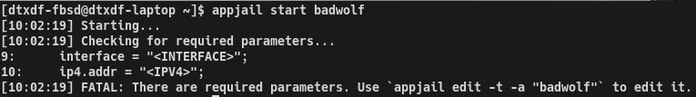
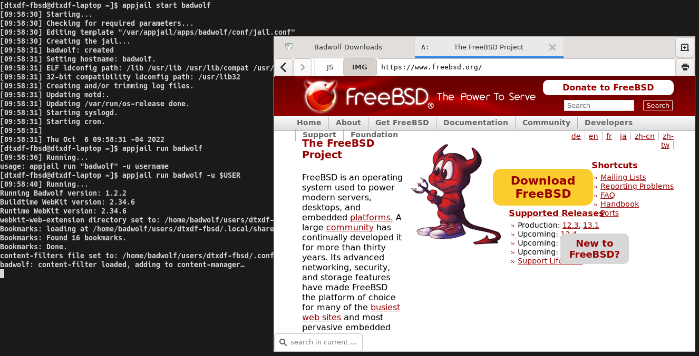
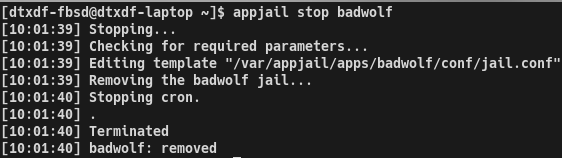
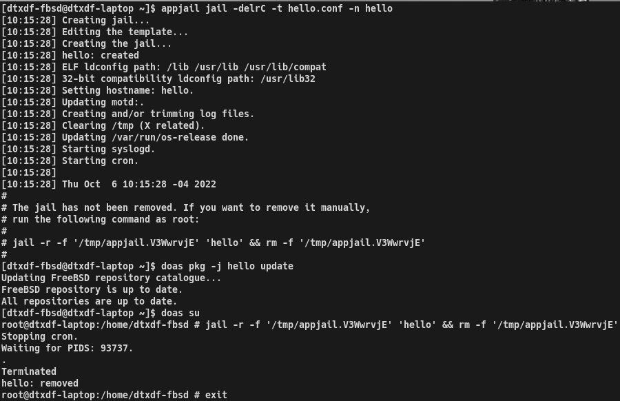
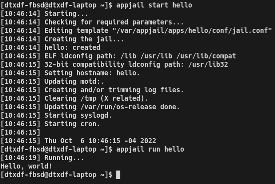
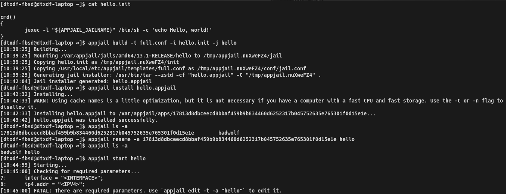

# AppJail

The AppJail utility is a bunch of scripts that allow you to easily create, maintain and share a FreeBSD jail. AppJail is not a helper like iocage or bastille. AppJail relies on maintaing a separate jail.conf for each jail which is commonly called in the context of AppJail a "template" as we will see below.

## features

* Lightweight: It's just a bunch of scripts that use the base tools. It does not use a database. It only manages files that you can maintain. This is great because the base tools are easy to use and you can maintain your jails using only the base tools.
* AppJails: AppJail can package a jail and convert it into an AppJail file. It uses the init scripts (you'll see this later) that provide a way to run commands in the host and in the jail. This is great because you can easily package an application and share it to run in just a few seconds.
* Dedicaded user: AppJail uses a dedicated user and a group, so you can add users to the appjail group to divide the work between the users. However, when it needs privileges it uses the SU_CMD variable which defaults to su(1), but you can and should change it to doas(1) or sudo(8).
* Easy to expand: If you want, you can add a new command that does what you want in the AppJail context. This is great because changes in the future will be easier.

## Screenshots

<p align="center">
    
    <br>
    Badwolf cannot be started because there are required parameters.
</p>

<p align="center">
    
    <br>
    Running badwolf inside a jail.
</p>

<p align="center">
    
    <br>
    Stopping badwolf.
</p>

<p align="center">
    
    <br>
    Creating, updating and removing a jail "hello".
</p>

<p align="center">
    
    <br>
    Running "Hello, world!" inside a jail.
</p>

<p align="center">
    
    <br>
    Building and installing the appjail hello.
</p>

## Installation

```
# make create_user
# pw groupmod -n appjail -m <Your username here>
# make install
$ cp /usr/local/etc/appjail/appjail.conf.sample /usr/local/etc/appjail/appjail.conf
```

## Usage

Run `appjail help` to get all available commands. Use `appjail help <cmd>` to provide the help for that command.

## Semantic versioning

See [semver.org](https://semver.org).

## Contributing

If you have found a bug or have a recommendation or idea, just open a new issue. Of course, PRs are welcome.

## License

```
Copyright (c) 2022, Jesús Daniel Colmenares Oviedo <DtxdF@disroot.org>
All rights reserved.

This source code is licensed under the BSD-style license found in the
LICENSE file in the root directory of this source tree.
```